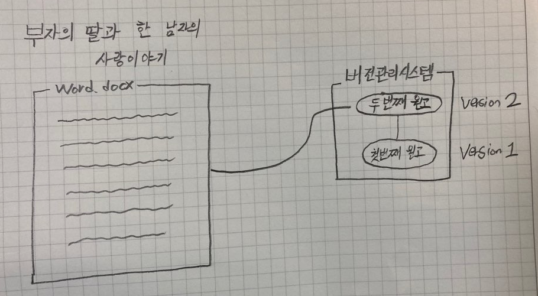

# 깃 기초

안녕하세요, 깃의 기초에 대해서 한 번 알아보려고 합니다. 제가 이 포스트를 통해 여러분이 얻어가셨으면 하는 것은 깃이 어떤 것인지 이해를 하고 기본적인 깃의 작업흐름을 이해해 여러분이 깃을 사용할 수 있었으면 좋겠습니다. 심화적인 부분은 다루지 않을 것이며, 아주 전반적인 기초만 다룰 것이기 때문에 외우려고 하기 보다는 이해하려고 노력해주셨으면 좋겠네요.

## 깃이란 무엇인가?

깃이란 리눅스 개발 커뮤니티에서 만든 분산 버전 관리 시스템입니다. 여러분도 아시다시피 리눅스는 오픈소스 운영체제로서, 전 세계의 개발자들에 의해서 개발되고 배포되고 있습니다. 옛날에는 리눅스를 압축파일과 패치로써 전하면서 개발하였는데, 효율적이지 못하여 Bitkeeper라는 분산버전관리 시스템을 사용하였죠. 하지만 무료로 사용하던 관계가 틀어지면서, 그들이 직접 분산버전관리 시스템을 개발하게 된 것입니다.

## 버전관리시스템(Version Control System)이란?

제가 위에서 깃이란 분산 버전 관리 시스템이라고 설명하였는데요. 그렇다면 버전관리 시스템이란 무엇일까요? 버전 관리 시스템이란 어떠한 파일들의 변화를 계속 기록하며, 어떠한 버젼을 이후에 불러낼 수 있게 해주는 시스템입니다. 저희는 프로그래머이기 때문에 아마 코드의 변화를 기록하는데 이 시스템을 쓰겠죠? 하지만 실제로 있어, 버전관리 시스템이란 컴퓨터에 있는 모든 파일의 변화를 기록하는데 쓰일 수 있습니다.

예를 들어서, 여러분이 글을 쓰는 작가라고 생각해볼게요. 막장 드라마의 원고를 쓰고 있다고 가정해볼게요.

**첫번째 원고**

주인공인 남자는 찢어지게 가난합니다. 하지만 씩씩하고 용감하죠 강합니다. 그러던 남자는 보디가드로 일하던 중 자신이 보디가드 하던 부자의 딸과 사귀게 되어 결혼을 하게 됩니다. 

여러분은 2달에 걸쳐 내용을 마무리했습니다. 그리고 보스한테 가서 원고를 승인을 받았습니다. 

**두번째 원고**

그러던 도중, 갑자기 생각해보니 내용이 너무 심심했습니다. 막장 드라마라기에는 내용이 너무 심심한거죠. 그래서 여러분은 딸의 아버지인 부자가 그 사실을 알게되어서, 주인공을 해외로 멀리 보내버리고 딸은 우울증에 걸리고 드라마가 끝이 나게 바꾸었습니다. 그러면서 첫번째 원고의 내용도 대폭 수정하게 되었죠.

여러분은 이것을 1달에 걸쳐서 마무리했습니다. 그리고 보스한테 들고가니 엄청 야단을 칩니다. 당신 뭐하는 것이냐고, 당장 짜르기 전에 다시 첫번째 원고대로 다시 돌리라고 합니다.

**문제**

여러분은, 하나의 word 파일에 내용을 저장해왔습니다. 지금 두번째 원고를 완성한 이 시점에, 첫번째 원고를 따로 저장을 해두지 않았기 때문에 다시 그대로 돌릴 방법은 없습니다.... 다시 기억을 더듬으며 1~2달을 수정하는데 시간을 보내야겠죠.

하지만! 여러분이 버전 관리 시스템을 사용하고 있었다면 이야기는 달라집니다. 버전 관리 시스템은 모든 변화를 기록해주는 마법의 '저장버튼' 이라고 생각해보세요. 여러분이 첫번째 원고를 저장을 하고, "첫번째 원고" 라는 버젼을 만들어 저장을 하였습니다. 그리고 두번째 원고를 완성을 한 뒤, "두번째 원고" 라는 버젼을 만들어 저장을 하였습니다. 버전 관리시스템은 파일의 버젼을 다 기록을 하고 있기 때문에, 그 당시의 버전으로 원한다면 언제나 돌아갈 수 있습니다. 

그래서 여러분의 보스가 당장 첫번째 원고로 되돌려! 라고 하면 문제 없이 돌릴 수 있는 것이죠.



## 세 가지 버전 관리시스템

이러한 버전관리시스템에는 3가지 종류가 있습니다. 로컬 버전 관리, 중앙집중식 버전 관리, 그리고 깃이 사용하는 분산 버전 관리가 있습니다. 각 종류들의 특징에 대해서 약간 살펴보겠습니다.

### 로컬 버전 관리 시스템

많은 사람들이 파일을 관리할 때, 보통 파일을 복사해서 다른 폴더에 놔두고는 합니다. 이것이 아주 편하기는 하지만, 실수를 할 확률이 아주 많습니다. 어디에 파일을 복사해 두었는지 잊을 수도 있고, 파일을 지워버릴 수도 있어요. 그래서 이런 이슈를 해결하기 위해서 프로그래머들이 로컬 버전 관리 시스템이라는 것을 개발했습니다. 로컬 버전 관리는 아주 간단한 데이터베이스를 컴퓨터에 만들어 거기에 파일의 변화를 관리하는 시스템입니다.

<!-- 로컬 VCS 사진 -->

위의 그림을 보시면, 오른쪽에 버젼을 관리하는 데이터베이스가 있습니다. 그리고 버젼별로 나누어져있어서, 우리가 원하는 버전을 불러와 사용하여 줄 수 있습니다. 이것만으로도 사실 아주 좋습니다. 하지만 이렇게 로컬 버전 관리를 사용하다 보면 문제가 한 가지 생깁니다. 그것이 무엇이라고 생각하시나요?

### 중앙집중식 버전관리

로컬 버전 관리 시스템을 사용하다 보면 문제가 생기는데, 그것은 사람들이랑 협력을 해야할 경우 입니다. 버전을 관리해주는 데이터베이스가 우리 컴퓨터에만 있기 때문에 사람에게 그것을 전해주려면 아주 힘들겠죠? 그리하여 생겨난 것이 중앙 집중식 버전관리 시스템이라는 것입니다. 이것이 동작하는 방식은, 한 개의 서버가 있고, 그 서버에서 모든 파일의 버전을 관리하며 유저들이 서버에 접근하여 파일을 얻는 방식입니다.

<!-- 중앙집중식 VCS 사진 -->

### 분산 버전 관리시스템

앞의 두 버전 관리 시스템에서 설명된 문제들을 해결하기 위하여 생겨난 것이 분산 버전 관리 시스템입니다. 깃이 분산 버전 관리 시스템의 대표적인 예입니다. 분산 버전 관리시스템이 깃이라는 것은 아니고, 깃은 분산버전관리 시스템의 대표적인 예입니다. 조금 전위에서 언급한 Bitkeeper와 같이 다른 분산버전관리 시스템들도 존재하지만 깃이 최근에 가장 대표적입니다.
분산 버전 관리 시스템의 좋은 점은 파일의 마지막 버전만 가져오는 것이 아니라, 그 파일의 모든 히스토리를 가져오기 때문에, 어떠한 한 프로젝트에 여러 명이 분산 버전 관리 시스템을 이용하여 작업을 하고 있으면, 서버가 날라가거나 하는 사고가 나도 모두가 백업을 가지고 있어 아주 안전 합니다.

## 깃을 왜 사용할까?

우리는 위에서 세 가지의 버전 관리 시스템에 대해서 알아보았습니다. 여러분은 이제 세 가지 시스템에서 뭐가 가장 적합하다고 생각하시나요? 아마도 분산 버전 관리 시스템이라고 생각하실 겁니다. 그래서 우리가 분산 버전 관리 시스템의 대표적인 깃을 사용하는 이유를 개발의 관점에서 본다면,

- 원하는 프로젝트의 버전으로 쉽게 돌아갈 수 있음
- 메인 코드를 망치지 않고 새로운 기능을 개발할 수 있음(브랜치)
- 다른 개발자들과의 협력이 아주 쉬움

등등이 있을 것 같습니다.

### 깃허브

<!-- 순서정하기 -->

## 깃 설치하기

자 그러면, 이제 깃을 한 번 설치해보도록 하겠습니다. 아마 여러분이 깃이 이미 설치되어 있어도, 업데이트를 하는 것이 좋을 것이기 때문에 같이 해보겠습니다.

- [윈도우 깃 설치](https://git-scm.com/download/win)
- [맥 깃 설치](https://git-scm.com/download/mac)

위의 링크 중, 자신의 운영체제에 맞는 것을 선택하여, 다운로드하고 설치를 진행해 주시면 됩니다.
설치가 제대로 되어있는지 확인하기위해서 `git --version` 이라는 명령어를 실행해주고, 제대로된 출력물이 나오면 설치가 제대로 된 것입니다.

## 깃 셋업하기

깃을 다 설치하고 나면, 깃을 사용하기 전에 세팅을 해주어야 합니다. 가장 먼저 해주어야 할 것이 유저이름과 이메일 주소를 세팅하는 것입니다 .이것이 중요한 이유는 모든 깃 커밋을 할 때, 저장을 한다고 지금은 얘기를 해봅시다. 여러분이 저장 버튼을 누를 때, 깃이 여러분이 초기에 세팅해 준 유저이름과 이메일을 포함시킵니다. 그래서 누가 저장 버튼을 눌렀는지, 언제 눌렀는지 등등의 정보를 포함하고 있죠. 이것은 한 번만 해주면 됩니다.

```shell
$ git config — global user.name “이름”

$ git config — global user.email “이메일”
```

위의 명령어들을 입력해주고 나서, 이제 설정이 제대로 되었는지를 확인해야 되겠죠?

```shell
$ git config --list
```

를 입력해주면, 깃의 모든 설정을 보여줄텐데요. 거기서 user.name과 user.email이 제대로 설정되어 있는지를 확인해 주시면 됩니다.

## 깃 도움 얻는 방법

여러분이 깃을 사용하다 보면 어떠한 명령어가 무엇을 의미하는 지를 모를 때가 많을텐데요. 그러한 명령어에 대한 설명을 깃에서도 자체적으로 제공합니다. 우리가 위에서 쓴 ‘config’ 명령어를 한 번 살펴볼게요. 보는 방법에는 여러 가지 방법이 있습니다.

```shell
$ git help config
$ git config --help
$ man git-config
```

위의 명령어 중 아무것이나 사용하시면 git config에 대한 설명을 보실 수 있을 것입니다.

## 간단한 깃 용어 정리

### 레포지터리

자, 그러면 이제 깃 레포지터리에 대해 한 번 알아보려 합니다. 깃 레포지터리란 우리 말로 저장소라고도 하는데, 여러분이 깃으로 관리하고 싶은 프로젝트를 담아주는 저장공간이라고 생각하시면 되겠습니다. 여러분은 여러 개의 저장소를 컴퓨터에 가질 수 있습니다.

<!-- 레포지터리 사진 -->

여러분이 레포지터리를 여러분이 진행하고 있는 프로젝트 디렉토리에 생성을 해주면, 최상위 디렉토리에 깃 레포지터리가 생성됩니다. 그렇기 때문에 깃 레포지터리는, 프로젝트 디렉토리 안에서 일어나는 모든 변화를 관찰하고 기록합니다. 그래서 깃에서는, 데이터를 잃어버리기가 아주 어렵다고 얘기를 합니다. 좋은 뜻이겠죠?

### 커밋

깃에는 커밋이라는 것이 있는데, 특정 저장 시점이라고 보시면 될 것 같습니다. 여러분이 커밋을 하실 때마다, 깃은 현재 여러분의 프로젝트의 상태를 저장시키고 계시는 겁니다.

<!-- 커밋 사진 -->

보통 커밋은 여러분이 어떠한 논리적인 기능이나 원하고자 하는 바를 완성하셨을 때 하시면 됩니다. 예를 들어, 우리가 웹사이트를 만들고 있다고 해보죠. 처음에 index.html 파일에 여러가지 태그들을 넣어주겠죠. 첫번째로, 헤더부분이 완성되면 여러분은 커밋을 합니다. 헤더가 완성된 현재 상태의 프로젝트를 저장한다고 보시면 됩니다. 그 다음 푸터를 완성하면, 푸터를 완성한 상태를 저장하고, 이런 식으로 프로젝트를 완성하기 까지 수 많은 상태들을 저장하고 계시는 겁니다.

깃이 아주 좋은 이유가 무엇이냐면, 여러 분이 원한다면, 커밋을 했을 당시의 상태로 마음대로 돌아갈 수 있다는 것입니다. 예를 들어 여러분이 처음 헤더완성 했을 당시의 코드로 돌아가고 싶다면, 여러분은 몇 개의 명령어로 아주 간단하게 돌아가실 수 있습니다.

## 깃 레포지터리 생성하기

자, 이제 실제로 깃 레포지터리를 한 번 생성해보겠습니다. 깃 레포지터리를 가지는 시나리오에는 보통 두 가지 시나리오가 있습니다.

1. 버젼 관리 시스템이 적용되지 않은 로컬 폴더를 깃 레포지터리로 바꾸는 방법
2. 이미 존재하는 깃 레포지터리를 클론(복사) 하는 방법

두 개다 순차적으로 한 번 살펴보겠습니다.

### 이미 존재하는 로컬 디렉토리에 레포지터리 생성하기

우리는 한 번도 깃을 써보지 않았으니, 아마 컴퓨터에 깃 레포지터리가 없을 것입니다. 그래서 새로운 폴더를 만들어서 깃 레포지터리를 한 번 만들어 보겠습니다.

먼저 여러분의 운영체제에 맞는 커맨드라인 인터페이스를 켜주세요. 그 다음 아래의 명령어를 실행해주세요.

```shell
$ cd Desktop
$ mkdir jasmine-calculator
$ cd jasmine-calculator
```

우리는 Desktop 디렉토리에 jasmine-calculator라는 디렉토리를 만들어 주었습니다. 그리고 나서 한 번 ls -la 명령어를 실행해 어떤 것들이 있는지 확인해보죠.

```shell
drwxr-xr-x    2 sanghakkim  staff    64 Jul 21 23:15 .
drwx------@ 109 sanghakkim  staff  3488 Jul 21 23:15 ..
```

여러분은 딱히 아무 것도 없는 것을 확인하실 수 있습니다. 그러면 이제 깃 레포지터리를 한 번 생성해보죠. 아래의 명령어를 입력해주세요.

```shell
$ git init
Initialized empty Git repository in /Users/sanghakkim/Desktop/jasmine-calculator/.git/
```

빈 레포지터리가 성공적으로 생성되었다고 출력될 것입니다. 그리고 나서 다시 ls -la 명령어를 실행해보면,

```shell
$ ls -la
drwxr-xr-x    3 sanghakkim  staff    96 Jul 21 23:16 .
drwx------@ 109 sanghakkim  staff  3488 Jul 21 23:15 ..
drwxr-xr-x   10 sanghakkim  staff   320 Jul 21 23:16 .git
```

최상위 디렉토리에 깃 레포지터리가 생성되었음을 알 수 있습니다. 이제 몇 가지 파일들을 한 번 추가해볼게요.

```shell
$ touch index.html style.css script.js
```

성공적으로 3개의 파일을 추가해주었습니다. 그러면 이제 실제로 커밋을 한 번 해볼까요? 먼저 우리는 금방 우리가 만든 파일을 깃이 관리를 하게 만들어야 합니다. add 명령어를 통해서 우리가 금방 만든 파일을 관리하게 만들어 주면 됩니다. 먼저 index.html 파일을 관리를 해보겠습니다.

```shell
$ git add index.html
```

그러면 이제 깃이 index.html 파일을 관리하기 시작할 것입니다. 깃에서는 추적을 하고 있다고 얘기합니다. git status 라는 명령어를 통해 확인해 볼 수 있습니다.

```shell
$ git status
On branch master
No commits yet
Changes to be committed:
  (use "git rm --cached <file>..." to unstage)
 new file:   index.html
Untracked files:
  (use "git add <file>..." to include in what will be committed)
 script.js
 style.css
```

보시면 index.html 파일이 Changes to be Committed라는 란에 들어가 있는 게 보이실 겁니다. 이 말은 깃이 index.html 파일을 추적하기 시작하였고, 커밋을 할 준비가 완료되었다는 말입니다.
만약에 여러분이 폴더에 있는 모든 파일을 추적하고 싶다면 . 을 통해 쉽게 하실 수 있습니다.

```shell
$ git add .
$ git status
On branch master
No commits yet
Changes to be committed:
  (use "git rm --cached <file>..." to unstage)
 new file:   index.html
 new file:   script.js
 new file:   style.css
```

모든 파일이 커밋을 할 준비가 완료되었다고 나타납니다.

자 그러면, 우리는 이제 커밋을 해주기만 하면 됩니다. `git commit` 명령어를 통해 하실 수 있습니다.

```shell
$ git commit -m "Our First Commit"
[master (root-commit) b940732] Our First commit
 3 files changed, 0 insertions(+), 0 deletions(-)
 create mode 100644 index.html
 create mode 100644 script.js
 create mode 100644 style.css
```

보통 커밋을 할 때는 메세지를 추가 시키는데, 여러분의 파일 상태에 맞는 메세지를 추가시켜주는 것이 아주 중요합니다. 금방 같은 경우에는, 우리가 파일을 생성하고 첫번째 커밋을 하였기 때문에 First Commit이라는 메세지를 넣어주었습니다. 예를 들어, 여러분이 css를 사용해 헤더 디자인을 완성했다고 합시다. 그리고 나서 커밋을 한다면 git commit -m “Finished the header design” 처럼 의미있는 나중에 알아보기 쉬운 메세지를 꼭 입력해주세요.

마지막으로 git log 명령어를 통하여, 커밋 기록들을 살펴보실 수 있습니다.

```shell
$ git log
commit b9407321a8e52eb1651c04db7c99a1d59bc0efeb (HEAD -> master)
Author: SangHak <k3hppk@gmail.com>
Date:   Tue Jul 21 23:30:00 2020 +0900

Our First commit
```

### 깃 레포지터리 클론하기

위에서는 이미 존재하는 폴더에 깃 레포지터리를 생성해보았는데요. 이번에는 이미 존재하는 깃 레포지터리를 우리 컴퓨터로 복사해오는 방법을 진행해 보려 합니다. 이것에 언제 유용하냐면은, 예를 들어 여러분이 어떤 사람의 프로젝트를 여러분의 프로젝트에 시작점으로 삼는다거나, 코드 등을 참조할 때 사용할 수 있습니다.

제가 깃허브에 올려둔 jasmine-calculator 레포지터리를 한 번 복사해보겠습니다. 먼저 jasmine-calcaultor 링크<!--링크넣기 -->를 눌러, 저의 레포지터리로 한 번 가볼게요.

<!-- 클론하는 사진 -->

위의 상단에 보시면, HTTPS로 클론하기 라는 것이 있습니다. Code를 클릭하셔서 주소를 복사하시면 됩니다. 그리고 다시 터미널로 돌아와서, 아래의 명령어와 함께 아까 복사한 주소를 같이 입력해줍니다.

```shell
$ git clone https://github.com/DaeguDude/jasmine-calculator
Cloning into 'jasmine-calculator'...
remote: Enumerating objects: 5, done.
remote: Counting objects: 100% (5/5), done.
remote: Compressing objects: 100% (3/3), done.
remote: Total 5 (delta 1), reused 5 (delta 1), pack-reused 0
Unpacking objects: 100% (5/5), done.
```

이렇게 해주면, 위처럼 성공적으로 클론이 완료되었다는 출력물이 나올 것입니다. 그리고 나서 확인을 해보시면 저희 컴퓨터에 jasmine-calculator라는 이름의 폴더가 생성이 되어있을 것입니다. git clone 이 해주는 일은, jasmine-calculator라는 프로젝트를 내려 받으면서, .git이라는 서브폴더를 생성한 후 그 레포지터리 안의 모든 히스토리를 내려받습니다. 확인해보시면 아까 제가 작성한 모든 파일들이 있는 것을 확인해 보실 수 있을 것입니다.

## 깃의 세가지 상태

저희는 위의 예제를 통해서, 깃 레포지터리 생성하는 2가지 방법을 알아보았습니다. 이제 여러분의 깃에 대한 이해를 도와줄 개념에 대해서 조금 설명해보려고 합니다. 사실 이 부분을 이해하는게 가장 중요할지도 모르겠습니다. 깃에서는 파일이 머물 수 있는 세 가지 상태가 있습니다.

- 수정된(modified)상태
- 준비된(staged)상태
- 완료된(committed)상태

수정된 상태는 여러분이 파일을 바꾸었지만, 여러분의 데이터베이스에 커밋을 하지 않은 상태를 얘기 합니다. 그리고 준비된 상태란 여러분이 수정한 파일을 커밋을 할 거라고 표시한 파일을 얘기합니다. 마지막으로 완료된 상태란 데이터가 로컬 데이터베이스에 안전하게 저장됐다는 것을 의미합니다. 여기서부터는 이제 데이터를 잃어버리기가 쉽지 않습니다. 이미 저장이 되어있기 때문이죠.
깃이 파일을 관리하는 세가지 상태는, 깃 프로젝트의 세 가지 단계와 또 연결이 되어있습니다.

- 워킹디렉터리(Working Directory)
- 스테이징 공간(Staging Area)
- 깃 디렉터리(Git Directory)

<!-- 세가지 단계에 대한 사진 -->

워킹 디렉터리는 프로젝트의 특정 버전을 가져온 상태입니다. 예를 들어, 여러분이 첫번째 커밋을 했을 때, 그 특정 버전을 가져와 워킹 디렉터리를 생성합니다. 그러므로 여러분이 처음에 깃 레포지터리를 생성하면 워킹 디렉터리는 없는 상태죠. 워킹 디렉터리는 여러분이 프로젝트를 수정하는 공간입니다.

다음으로 스테이징 공간은, 여러분이 워킹 디렉터리에서 수정을 마치고, 커밋을 할 준비를 할 때, 파일들을 스테이징 공간으로 넘겨줍니다. 우리는 이것을 stage한다고 얘기를 합니다. 지금 이 공간에 있는 상태가, 여러분이 커밋을 했을 때 저장될 상태입니다.

마지막으로 여러분이 커밋을 하면, 스테이징 공간에 있는 상태가 깃 디렉터리에 영구적으로 저장될 것입니다.

이렇게 깃의 파일의 상태와 세 가지 단계는 요긴하게 연결되어 있습니다. 워킹 디렉토리에서 수정된 파일은 수정된(modified) 상태이고, 스테이징 공간으로 넘어온 파일은 준비된(staged) 상태이고, 마지막으로 깃 디렉터리에 있는 파일들은 완료된(committed) 상태입니다.

## 깃허브에 올리기

여러분이 이때까지 작업한 깃은 어떻게 보면 모두 다 여러분의 컴퓨터에서 이루어졌습니다. 하지만, 다른 사람들과 작업을 하려면 레포지터리가 여러분의 컴퓨터에만 있으면 안되겠죠? 여러분이 작업을 한 것을 올려야 될 것입니다. 아까도 언급했지만, 깃허브가 온라인 서비스이며 레포지터리 저장을 무료로 해줍니다.

먼저 서비스를 사용하려면, 깃허브에 가입을 해야합니다. 깃허브에 가입부터 해봅시다.

깃허브 가입을 완료하고 나서, 레포지터리를 생성해줄 것입니다. 아까 제가 만든 계산기 프로젝트말고, 여러분의 계산기 프로젝트를 한 번 직접 생성해볼게요. 깃허브의 레포지터리란으로 가셔서, new를 누르시면 아래의 그림이 뜰 것입니다.

<!-- 레포지터리 생성 사진 -->

Repository name에 여러분이 원하시는 레포지터리의 이름을 적어주면 됩니다. 하지만 주의해야할 점은 여러분의 프로젝트에 알맞는 이름을 작성해주세요. 그리고 나서, Create repository를 눌러주면 레포지터리가 생성될 것입니다.

레포지터리가 생성된 후에, 두 가지 안내문이 뜰 것입니다. 이것은 두 가지 시나리오에 따른 방법인데, 첫번째 방법은 여러분의 컴퓨터에 깃 레포지터리가 없을 때의 시나리오 입니다. 그리고 두 번째 시나리오는, 이미 깃 레포지터리가 여러분의 컴퓨터에 있고, 그냥 연결을 시켜주고 싶을 때의 상황입니다.

<!-- 레포지터리 생성 후 사진 -->

저희는 이미 깃 레포지터리가 우리의 컴퓨터에 있는, 두번째 시나리오를 한 번 따라가보도록 할게요. 먼저 calculator라는 폴더를 만들고, 거기로 이동해주세요.

```shell
$ mkdir calculator
$ cd calculator
```

그런 다음, 계산기에 필요한 몇 가지 파일을 집어넣어줄게요.

```shell
$ touch index.html style.css calc.js
```

그리고 이 프로젝트에 대한 정보를 README.md 파일에 생성하여 적어줍니다.

```shell
$ echo "# 계산기 프로젝트" >> README.md
```

그리고 이제 마지막으로, 깃 레포지터리를 생성하고 모든 파일을 커밋해줍니다.

```shell
$ git init 
$ git add -A
$ git commit -m "First Commit"
```

자, 그러면 지금 여러분의 컴퓨터에 있는 깃 레포지터리는 완성이 되어있습니다. 하지만 여러분의 컴퓨터에 있는 레포지터리를 깃허브에 있는 레포지터리와 연결시켜주지 않았죠. 이제 연결시켜보겠습니다. 여러분의 깃허브 레포지터리에 들어가면 뜨는 안내문에서 두번째 것을 따라하겠습니다.

```shell
$ git remote add origin git@github.com:DaeguDude/calculator.git
```

그리고 나서 제대로 추가가 되었는지 확인해보아야겠죠?

```shell
$ git remote -v
origin git@github.com:DaeguDude/calculator.git (fetch)
origin git@github.com:DaeguDude/calculator.git (push)
```

그러면 여러분의 깃허브에 있는 레포지터리가 컴퓨터에 있는 레포지터리와 연결되었음을 확인하실 수 있을 것입니다. 이제 마지막으로 깃허브 레포지터리에 올려주기만 하면됩니다. git push 명령어를 통해 올려줄 수 있습니다.

```shell
$ git push -u origin master
Enumerating objects: 4, done.
Counting objects: 100% (4/4), done.
Delta compression using up to 6 threads
Compressing objects: 100% (2/2), done.
Writing objects: 100% (4/4), 305 bytes | 305.00 KiB/s, done.
Total 4 (delta 0), reused 0 (delta 0)
To github.com:DaeguDude/calculator.git
 * [new branch]      master -> master
Branch 'master' set up to track remote branch 'master' from 'origin'.
```

그리고 나서 여러분의 깃허브 레포지터리를 확인해보시면, 여러분의 커밋이 성공적으로 올라간 것을 확인해보실 수 있습니다.

<!-- 커밋 성공후의 사진 -->

## 깃 일반적인 작업흐름도(브랜치)

이번에는 깃의 일반적인 작업흐름에 대해서 배워볼까 합니다. 제가 처음에 설명드렸듯이, 깃은 메인 코드베이스를 망치지 않고 새로운 기능을 개발할 수 있다고 하였습니다. 이것을 가능하게 하는 것이 브랜치라는 것인데요. 보통 개발을 할 때, 어떠한 기능을 구현하고자 할 때 그 기능에 맞는 브랜치를 만들고 그 환경에서 작업을 시작합니다.

### 브랜치 생성

그러면 브랜치를 한 번 생성해보겠습니다.

```shell
$ git branch calc-divide
$ git checkout calc-divide
Switched to branch 'calc-divide'
```

먼저, `git branch` 명령어를 통해 calc-divide라는 나누기에 관련된 기능을 개발할 브랜치를 만들어주고, `git checkout` 을 통해 그 브랜치로 이동을 해줍니다.

한 번 제대로 이동이 되었는지 확인해볼게요. `git branch` 명령어를 아무 인수없이 입력해주면, 현재있는 모든 브랜치가 나타납니다.

```shell
$ git branch
* calc-divide
  master
```

그리고 나서, VScode로 가서 작업을 합니다. 작업이 끝나고 난 뒤, 이제 그 브랜치에서 새로운 커밋을 만들어주면 됩니다.

```shell
$ git add -A
$ git commit -m "Divide Function"
[calc-divide 1fea8f5] Divide Function
 1 file changed, 4 insertions(+)
```

이제 커밋을 완료했으니, 우리 깃허브 레포지터리에도 이 커밋을 업데이트 해주어야 합니다. 이렇게 브랜치를 나누어서 작업을 해주는 이유는, 메인 코드베이스를 망치지 않고 작업을 하기 위해서입니다. 브랜치가 나누어져있으면 이제 나중에 코드가 잘 작동하는지 테스트 할 때 아주 유용하죠.

그러면, 깃허브 레포지터리에도 업데이트를 해주겠습니다.

```shell
$ git push -u origin calc-divide
To github.com:DaeguDude/calculator.git
 * [new branch]      calc-divide -> calc-divide
Branch 'calc-divide' set up to track remote branch 'calc-divide' from 'origin'.
```

업데이트를 하고 나서 깃허브 레포지터리로 가서 한 번 확인을 해보면, 제대로 업로드 된 것을 확인하실 수 있을 겁니다.

그리고 또한, 컴퓨터에서 깃허브 레포지터리에 어떤 브랜치가 있는지도 확인해 줄 수 있습니다. git branch -a 명령어는, 여러분의 로컬 레포지터리와 연결되어있는 레포지터리의 모든 브랜치를 보여줍니다.

```shell
$ git branch -a
* calc-divide
  master
  remotes/origin/calc-divide
  remotes/origin/master
```

총 4개의 브랜치가 있는 것이 확인되실 겁니다.

### 브랜치 합치기

여러분이 이제 calc-divide 브랜치에서 모든 것을 완료했다고 가정해봅시다. 어떤 번호를 집어넣어도 나누기가 제대로 되기 때문에 이제 이 기능은 메인 코드베이스에 합치면 됩니다. 저희 메인 코드베이스는 master 브랜치니까 거기로 한 번 합쳐보겠습니다.

먼저, master 브랜치로 이동해줍니다.

```shell
$ git checkout master
$ git pull origin master
From github.com:DaeguDude/calculator
 * branch            master     -> FETCH_HEAD
Already up to date.
```

그리고 git pull origin master를 통해, 여러분이 calc-divide에서 작업하고 있었던 동안, 다른 사람이 master 브랜치에 새로운 코드를 업데이트 했을 수도 있으니 그 코드를 내려받아 여러분의 코드와 합칩니다.

그리고 나서, 여러분의 master 브랜치에 이때까지 합쳐진 브랜치가 있는지 확인해봅시다.

```shell
$ git branch --merged
* master
```

이 때까지 아무것도 합치지 않았으니, master 브랜치만 나타날 것입니다. 이제, calc-divide 브랜치를 master 브랜치로 합쳐줄 시간입니다.

```shell
$ git merge calc-divide
Updating 2508a62..1fea8f5
Fast-forward
 calc.js | 4 ++++
 1 file changed, 4 insertions(+)
```

Fast-forward를 통해, 합쳐진 것을 확인해 보실 수 있습니다. 혹시 모르니 명령어를 통해 살펴보죠.

```shell
$ git branch --merged
  calc-divide
* master
```

성공적으로 합쳐졌습니다. 하지만, 새로운 master 브랜치는 여러분의 컴퓨터에만 있는 것이지, 깃허브 레포지터리에 업데이트 되지 않았습니다. 그러므로 업데이트를 해주어야 겠죠.

```shell
$ git push origin master
```

저희는 나누기 기능을 이제 개발을 끝내었기 때문에, 그 브랜치가 이제 필요가 없습니다. 그래서 브랜치를 지워주어야 합니다.

```shell
$ git branch -d calc-divide
Deleted branch calc-divide (was 1fea8f5).
```

그러면 성공적으로 브랜치가 지워졌다고 뜰 것입니다. 그러면 어떤 브랜치들이 남아있는지 다시 한 번 확인해볼까요?

```shell
$ git branch -a
* master
  remotes/origin/calc-divide
  remotes/origin/master
```

아차, 아직 깃허브 레포지터리에 있는 calc-divide 브랜치가 남아있음을 알 수 있습니다. 이것도 필요가 없으니 지워주는게 맞겠죠?

```shell
$ git push origin --delete calc-divide
To github.com:DaeguDude/calculator.git
 - [deleted]         calc-divide
```

깃에서 할 수 있는 기본적인 것들에 대해서 한 번 다루어보았습니다.

### 참고사항

많은 내용들은 오픈소스 프로젝트인 [The Odin Project](https://www.theodinproject.com/dashboard)에서 가져온 내용들입니다. 

- [progit(한국어)](https://git-scm.com/book/ko/v2)
- [Git & Github Tutorial for Beginners - Net Ninja](https://www.youtube.com/watch?v=3RjQznt-8kE&list=PL4cUxeGkcC9goXbgTDQ0n_4TBzOO0ocPR&ab_channel=TheNetNinja)
- [Git Tutorials - Corey Schafer](https://www.youtube.com/watch?v=HVsySz-h9r4&list=PL-osiE80TeTuRUfjRe54Eea17-YfnOOAx&ab_channel=CoreySchafer)

### 고칠점 / 연락하기

혹시나 글에서 고칠 점이나 추가되어야 할 점이 있다면, [Jasmine 깃허브](https://github.com/DaeguDude/jasmine)에서 issue를 생성해주시고, 개인적인 연락은 k3hppk@gmail.com 으로 주시면 됩니다.