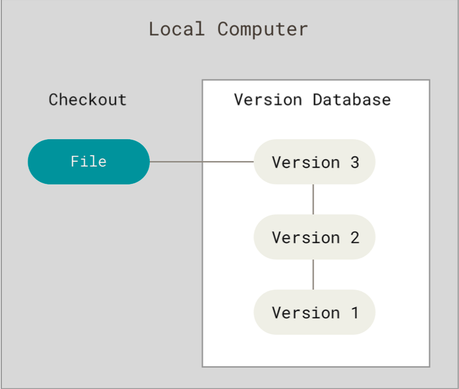
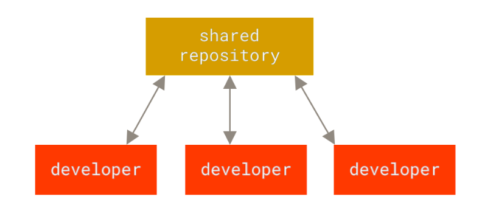
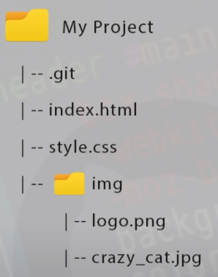
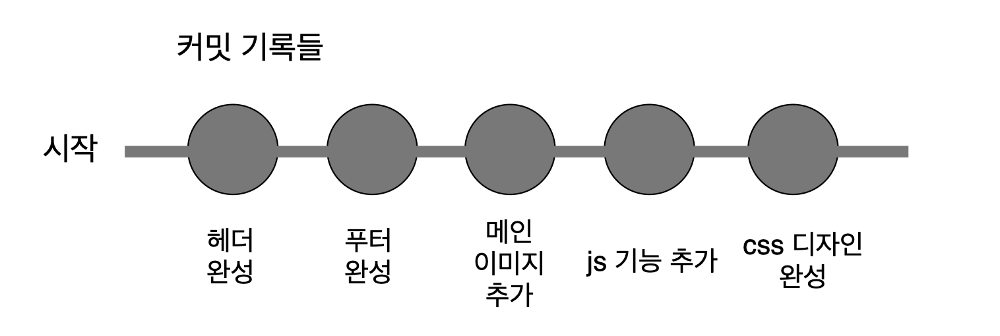
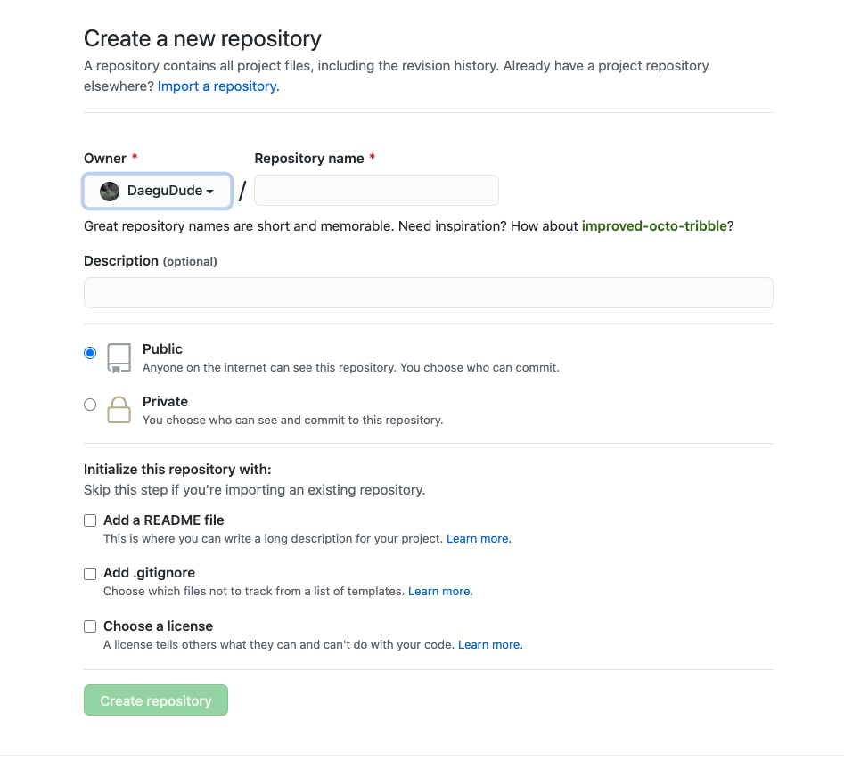
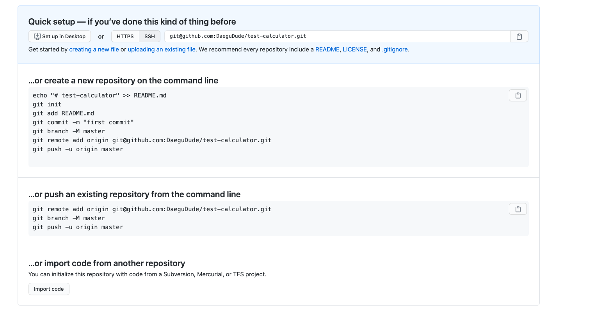
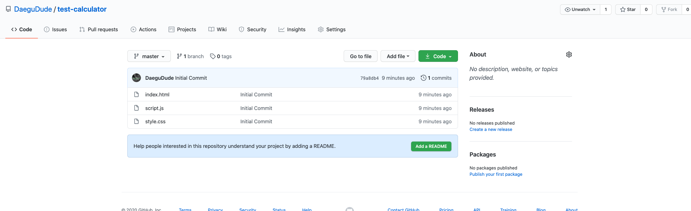
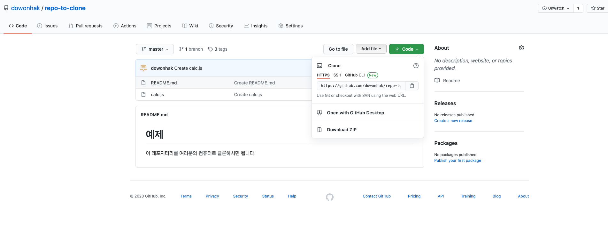
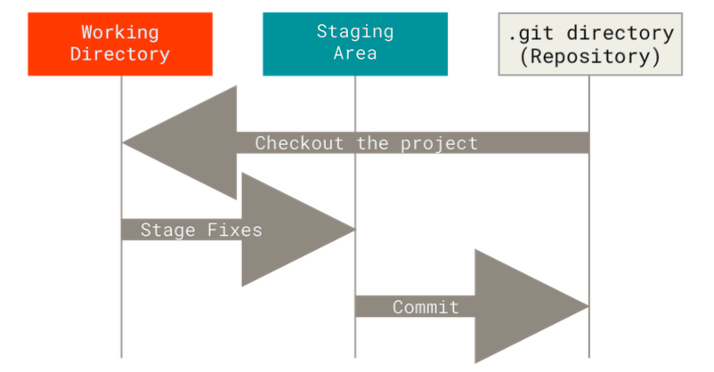

# 깃 기초

안녕하세요, 깃의 기초에 대해서 한 번 알아보려고 합니다. 제가 이 포스트를 통해 여러분이 얻어가셨으면 하는 것은 깃이 어떤 것인지 이해를 하고 기본적인 깃의 작업흐름을 이해해 여러분이 깃을 사용할 수 있었으면 좋겠습니다. 심화적인 부분은 다루지 않을 것이며, 아주 전반적인 기초만 다룰 것이기 때문에 외우려고 하기 보다는 이해하려고 노력해주셨으면 좋겠네요.

## 깃이란 무엇인가?

깃이란 리눅스 개발 커뮤니티에서 만든 분산 버전 관리 시스템입니다. 여러분도 아시다시피 리눅스는 오픈소스 운영체제로서, 전 세계의 개발자들에 의해서 개발되고 배포되고 있습니다. 옛날에는 리눅스를 압축파일과 패치로써 전하면서 개발하였는데, 효율적이지 못하여 Bitkeeper라는 분산버전관리 시스템을 사용하였죠. 하지만 무료로 사용하던 관계가 틀어지면서, 그들이 직접 분산 버전관리 시스템인 깃을 개발하게 된 것입니다.

## 버전관리시스템(Version Control System)이란?

제가 위에서 깃이란 분산 버전 관리 시스템이라고 설명하였는데요. 그렇다면 버전관리 시스템이란 무엇일까요? 버전 관리 시스템이란 어떠한 파일들의 변화를 계속 기록하며, 어떠한 버젼을 이후에 불러낼 수 있게 해주는 시스템입니다. 저희는 프로그래머이기 때문에 아마 코드의 변화를 기록하는데 이 시스템을 쓰겠죠? 하지만 실제로 있어, 버전관리 시스템이란 컴퓨터에 있는 모든 파일의 변화를 기록하는데 쓰일 수 있습니다.

예를 들어서, 여러분이 글을 쓰는 작가라고 생각해볼게요. 막장 드라마의 원고를 쓰고 있다고 가정해볼게요.

**첫번째 원고**

주인공인 남자는 찢어지게 가난합니다. 하지만 씩씩하고 용감하죠 강합니다. 그러던 남자는 보디가드로 일하던 중 자신이 보디가드 하던 부자의 딸과 사귀게 되어 결혼을 하게 됩니다. 

여러분은 2달에 걸쳐 내용을 마무리했습니다. 그리고 보스한테 가서 원고를 승인을 받았습니다. 

**두번째 원고**

그러던 도중, 갑자기 생각해보니 내용이 너무 심심했습니다. 막장 드라마라기에는 내용이 너무 심심한거죠. 그래서 여러분은 딸의 아버지인 부자가 그 사실을 알게되어서, 주인공을 해외로 멀리 보내버리고 딸은 우울증에 걸리고 드라마가 끝이 나게 바꾸었습니다. 그러면서 첫번째 원고의 내용도 대폭 수정하게 되었죠.

여러분은 이것을 1달에 걸쳐서 마무리했습니다. 그리고 보스한테 들고가니 엄청 야단을 칩니다. 당신 뭐하는 것이냐고, 당장 짜르기 전에 다시 첫번째 원고대로 다시 돌리라고 합니다.

**문제**

여러분은 원고를 하나의 word 파일에서 저장해왔습니다. 지금 두번째 원고를 완성한 이 시점에, 첫번째 원고를 따로 저장을 해두지 않았기 때문에 다시 그대로 돌릴 방법은 없습니다.... 다시 기억을 더듬으며 1~2달을 수정하는데 시간을 보내야겠죠.

하지만! 여러분이 버전 관리 시스템을 사용하고 있었다면 이야기는 달라집니다. 버전 관리 시스템을 모든 변화를 기록해주는 마법의 '저장버튼' 이라고 생각해보세요. 여러분이 첫번째 원고를 저장을 하고, "첫번째 원고" 라는 버젼을 만들어 저장을 하였습니다. 그리고 두번째 원고를 완성을 한 뒤, "두번째 원고" 라는 버젼을 만들어 저장을 하였습니다. 버전 관리시스템은 파일의 버젼을 다 기록을 하고 있기 때문에, 그 당시의 버전으로 원한다면 언제나 돌아갈 수 있습니다. 

그래서 여러분의 보스가 당장 첫번째 원고로 되돌려! 라고 하면 문제 없이 돌릴 수 있는 것이죠.


## 세 가지 버전 관리시스템

이러한 버전관리시스템에는 3가지 종류가 있습니다. 로컬 버전 관리, 중앙집중식 버전 관리, 그리고 깃이 사용하는 분산 버전 관리가 있습니다. 각 종류들의 특징에 대해서 약간 살펴보겠습니다.

### 로컬 버전 관리 시스템

많은 사람들이 파일을 관리할 때, 보통 파일을 복사해서 다른 폴더에 놔두고는 합니다. 이것이 아주 편하기는 하지만, 실수를 할 확률이 아주 많습니다. 어디에 파일을 복사해 두었는지 잊을 수도 있고, 파일을 지워버릴 수도 있어요. 그래서 이런 이슈를 해결하기 위해서 프로그래머들이 로컬 버전 관리 시스템이라는 것을 개발했습니다. 로컬 버전 관리는 아주 간단한 데이터베이스를 컴퓨터에 만들어 거기에 파일의 변화를 관리하는 시스템입니다.



위의 그림을 보시면, 오른쪽에 버젼을 관리하는 데이터베이스가 있습니다. 그리고 버젼별로 나누어져있어서, 우리가 원하는 버전을 불러와 사용하여 줄 수 있습니다. 이것만으로도 사실 아주 좋습니다. 하지만 이렇게 로컬 버전 관리를 사용하다 보면 문제가 한 가지 생깁니다. 그것이 무엇이라고 생각하시나요?

### 중앙집중식 버전관리

로컬 버전 관리 시스템을 사용하다 보면 문제가 생기는데, 그것은 사람들이랑 협력을 해야할 경우 입니다. 버전을 관리해주는 데이터베이스가 우리 컴퓨터에만 있기 때문에 사람에게 그것을 전해주려면 아주 힘들겠죠? 그리하여 생겨난 것이 중앙 집중식 버전관리 시스템이라는 것입니다. 이것이 동작하는 방식은, 한 개의 서버가 있고, 그 서버에서 모든 파일의 버전을 관리하며 유저들이 서버에 접근하여 파일을 얻는 방식입니다.



### 분산 버전 관리시스템

앞의 두 버전 관리 시스템에서 설명된 문제들을 해결하기 위하여 생겨난 것이 분산 버전 관리 시스템입니다. 깃이 분산 버전 관리 시스템의 대표적인 예입니다. 분산 버전 관리시스템이 깃이라는 것은 아니고, 깃은 분산버전관리 시스템의 대표적인 예입니다. 조금 전위에서 언급한 Bitkeeper와 같이 다른 분산버전관리 시스템들도 존재하지만 깃이 최근에 가장 대표적입니다.
분산 버전 관리 시스템의 좋은 점은 파일의 마지막 버전만 가져오는 것이 아니라, 그 파일의 모든 히스토리를 가져오기 때문에, 어떠한 한 프로젝트에 여러 명이 분산 버전 관리 시스템을 이용하여 작업을 하고 있으면, 서버가 날라가거나 하는 사고가 나도 모두가 백업을 가지고 있어 아주 안전 합니다.

## 깃을 왜 사용할까?

우리는 위에서 세 가지의 버전 관리 시스템에 대해서 알아보았습니다. 여러분은 이제 세 가지 시스템에서 뭐가 가장 적합하다고 생각하시나요? 아마도 분산 버전 관리 시스템이라고 생각하실 겁니다. 그래서 우리가 분산 버전 관리 시스템의 대표적인 깃을 사용하는 이유를 개발의 관점에서 본다면,

- 원하는 프로젝트의 버전으로 쉽게 돌아갈 수 있음
- 메인 코드를 망치지 않고 새로운 기능을 개발할 수 있음(브랜치)
- 다른 개발자들과의 협력이 아주 쉬움

등등이 있을 것 같습니다.


## 깃 설치하기

자 그러면, 이제 깃을 한 번 설치해보도록 하겠습니다. 아마 여러분이 깃이 이미 설치되어 있어도, 업데이트를 하는 것이 좋을 것이기 때문에 같이 해보겠습니다.

- [윈도우 깃 설치](https://git-scm.com/download/win)
- [맥 깃 설치](https://git-scm.com/download/mac)

위의 링크 중, 자신의 운영체제에 맞는 것을 선택하여, 다운로드하고 설치를 진행해 주시면 됩니다.
설치가 제대로 되어있는지 확인하기위해서 `git --version` 이라는 명령어를 실행해주고, 제대로된 출력물이 나오면 설치가 제대로 된 것입니다.

## 깃 셋업하기

깃을 다 설치하고 나면, 깃을 사용하기 전에 세팅을 해주어야 합니다. 가장 먼저 해주어야 할 것이 유저이름과 이메일 주소를 세팅하는 것입니다 .이것이 중요한 이유는 모든 깃 커밋을 할 때, 저장을 한다고 지금은 얘기를 해봅시다. 여러분이 저장 버튼을 누를 때, 깃이 여러분이 초기에 세팅해 준 유저이름과 이메일을 포함시킵니다. 그래서 누가 저장 버튼을 눌렀는지, 언제 눌렀는지 등등의 정보를 포함하고 있죠. 이것은 한 번만 해주면 됩니다.

```shell
$ git config — global user.name “이름”

$ git config — global user.email “이메일”
```

위의 명령어들을 입력해주고 나서, 이제 설정이 제대로 되었는지를 확인해야 되겠죠?

```shell
$ git config --list
```

를 입력해주면, 깃의 모든 설정을 보여줄텐데요. 거기서 user.name과 user.email이 제대로 설정되어 있는지를 확인해 주시면 됩니다.

## 깃 도움 얻는 방법

여러분이 깃을 사용하다 보면 어떠한 명령어가 무엇을 의미하는 지를 모를 때가 많을텐데요. 그러한 명령어에 대한 설명을 깃에서도 자체적으로 제공합니다. 우리가 위에서 쓴 ‘config’ 명령어를 한 번 살펴볼게요. 보는 방법에는 여러 가지 방법이 있습니다.

```shell
$ git help config
$ git config --help
$ man git-config
```

위의 명령어 중 아무것이나 사용하시면 git config에 대한 설명을 보실 수 있을 것입니다.

## 간단한 깃 용어 정리

### 레포지터리

자, 그러면 이제 깃 레포지터리에 대해 한 번 알아보려 합니다. 깃 레포지터리란 우리 말로 저장소라고도 하는데, 여러분이 깃으로 관리하고 싶은 프로젝트를 담아주는 저장공간이라고 생각하시면 되겠습니다. 여러분은 여러 개의 저장소를 컴퓨터에 가질 수 있습니다.


*Credit:NetNinja*

여러분이 레포지터리를 여러분이 진행하고 있는 프로젝트 디렉토리에 생성을 해주면, 최상위 디렉토리에 깃 레포지터리가 생성됩니다. 그렇기 때문에 깃 레포지터리는, 프로젝트 디렉토리 안에서 일어나는 모든 변화를 관찰하고 기록합니다. 그래서 깃에서는, 데이터를 잃어버리기가 아주 어렵다고 얘기를 합니다. 좋은 뜻이겠죠?

### 커밋

깃에는 커밋이라는 것이 있는데, 특정 저장 시점이라고 보시면 될 것 같습니다. 여러분이 커밋을 하실 때마다, 깃은 현재 여러분의 프로젝트의 상태를 저장시키고 계시는 겁니다.



보통 커밋은 여러분이 어떠한 논리적인 기능이나 원하고자 하는 바를 완성하셨을 때 하시면 됩니다. 예를 들어, 우리가 웹사이트를 만들고 있다고 해보죠. 처음에 index.html 파일에 여러가지 태그들을 넣어주겠죠. 첫번째로, 헤더부분이 완성되면 여러분은 커밋을 합니다. 헤더가 완성된 현재 상태의 프로젝트를 저장한다고 보시면 됩니다. 그 다음 푸터를 완성하면, 푸터를 완성한 상태를 저장하고, 이런 식으로 프로젝트를 완성하기 까지 수 많은 상태들을 저장하고 계시는 겁니다.

깃이 아주 좋은 이유가 무엇이냐면, 여러 분이 원한다면, 커밋을 했을 당시의 상태로 마음대로 돌아갈 수 있다는 것입니다. 예를 들어 여러분이 처음 헤더완성 했을 당시의 코드로 돌아가고 싶다면, 여러분은 몇 개의 명령어로 아주 간단하게 돌아가실 수 있습니다.

### 깃허브
보통 어떠한 프로젝트를 할 때, 혼자서 하는 경우도 있지만 실제로 개발을 시작하면 여러 명과 함께 하는 경우가 많습니다. 우리는 그러면 파일을 어떻게 주고 받을까요?
깃허브라는 온라인 서비스가 있는데요. 깃허브는 깃 레포지터리를 저장할 수 있게 해주는 무료 웹 서비스입니다. 깃 레포지터리를 유지 및 관리해줍니다. 깃허브에 우리의 레포지터리를 저장함으로써 다른 프로그래머들과 코드를 공유할 수도 있고 서로 같이 프로젝트를 진행할 수도 있겠죠. 깃허브에는 많은 오픈소스 프로젝트들이 있는데요. 말 그대로 프로젝트가 오픈되어 있어, 누구라도 원한다면 프로젝트에 참여하고 기여할 수 있습니다.

## 깃 레포지터리 생성하기

자, 이제 실제로 깃 레포지터리를 한 번 생성해보겠습니다. 깃 레포지터리를 가지는 시나리오에는 보통 두 가지 시나리오가 있습니다.

1. 버젼 관리 시스템이 적용되지 않은 로컬 폴더를 깃 레포지터리로 바꾸는 방법
2. 깃허브에 존재하는 깃 레포지터리를 클론(복사) 하는 방법

두 개다 순차적으로 한 번 살펴보겠습니다.

### 이미 존재하는 로컬 디렉토리에 레포지터리 생성후 커밋하기

우리는 한 번도 깃을 써보지 않았으니, 아마 컴퓨터에 깃 레포지터리가 없을 것입니다. 그래서 새로운 폴더를 만들어서 깃 레포지터리를 한 번 만들어 보겠습니다.

먼저 여러분의 운영체제에 맞는 커맨드라인 인터페이스를 켜주세요. 그 다음 아래의 명령어를 실행해주세요.

```shell
$ cd Desktop
$ mkdir test-calculator
$ cd test-calculator
```

우리는 Desktop 디렉토리에 test-calculator라는 디렉토리를 만들어 주었습니다. 그리고 나서 한 번 `ls -la` 명령어를 실행해 어떤 것들이 있는지 확인해보죠.

```shell
drwxr-xr-x   2 sanghakkim  staff    64 Sep 22 10:30 .
drwx------@ 42 sanghakkim  staff  1344 Sep 22 10:30 ..
```

여러분은 딱히 아무 것도 없는 것을 확인하실 수 있습니다. 그러면 이제 깃 레포지터리를 한 번 생성해보죠. 아래의 명령어를 입력해주세요.

```shell
$ git init
Initialized empty Git repository in /Users/sanghakkim/Desktop/test-calculator/.git/
```

빈 레포지터리가 성공적으로 생성되었다고 출력될 것입니다. 그리고 나서 다시 ls -la 명령어를 실행해보면,

```shell
$ ls -la
total 0
drwxr-xr-x   3 sanghakkim  staff    96 Sep 22 10:31 .
drwx------@ 42 sanghakkim  staff  1344 Sep 22 10:30 ..
drwxr-xr-x  10 sanghakkim  staff   320 Sep 22 10:31 .git
```

최상위 디렉토리에 깃 레포지터리가 생성되었음을 알 수 있습니다. 이제 몇 가지 파일들을 한 번 추가해볼게요.

```shell
$ touch index.html style.css script.js
```

성공적으로 3개의 파일을 추가해주었습니다. 그러면 이제 실제로 커밋을 한 번 해볼까요? 먼저 우리는 금방 우리가 만든 파일을 깃이 관리를 하게 만들어야 합니다. add 명령어를 통해서 우리가 금방 만든 파일을 관리하게 만들어 주면 됩니다. 먼저 index.html 파일을 관리를 해보겠습니다.

```shell
$ git add index.html
```

그러면 이제 깃이 index.html 파일을 관리하기 시작할 것입니다. 깃에서는 추적을 하고 있다고 얘기합니다. git status 라는 명령어를 통해 확인해 볼 수 있습니다.

```shell
$ git status
On branch master

No commits yet

Changes to be committed:
  (use "git rm --cached <file>..." to unstage)
	new file:   index.html

Untracked files:
  (use "git add <file>..." to include in what will be committed)
	script.js
	style.css
```

보시면 index.html 파일이 Changes to be Committed라는 란에 들어가 있는 게 보이실 겁니다. 이 말은 깃이 index.html 파일을 추적하기 시작하였고, 커밋을 할 준비가 완료되었다는 말입니다.
만약에 여러분이 폴더에 있는 모든 파일을 추적하고 싶다면 . 을 통해 쉽게 하실 수 있습니다.

```shell
$ git add .
$ git status

On branch master

No commits yet

Changes to be committed:
  (use "git rm --cached <file>..." to unstage)
	new file:   index.html
	new file:   script.js
	new file:   style.css
```

모든 파일이 커밋을 할 준비가 완료되었다고 나타납니다.

자 그러면, 우리는 이제 커밋을 해주기만 하면 됩니다. `git commit` 명령어를 통해 하실 수 있습니다.

```shell
$ git commit -m "Initial Commit"
[master (root-commit) e5b72eb] Initial Commit
 3 files changed, 0 insertions(+), 0 deletions(-)
 create mode 100644 index.html
 create mode 100644 script.js
 create mode 100644 style.css
```

보통 커밋을 할 때는 메세지를 추가 시키는데, 여러분의 파일 상태에 맞는 메세지를 추가시켜주는 것이 아주 중요합니다. 금방 같은 경우에는, 우리가 파일을 생성하고 첫번째 커밋을 하였기 때문에 First Commit이라는 메세지를 넣어주었습니다. 예를 들어, 여러분이 css를 사용해 헤더 디자인을 완성했다고 합시다. 그리고 나서 커밋을 한다면 git commit -m “Finished the header design” 처럼 의미있는 나중에 알아보기 쉬운 메세지를 꼭 입력해주세요.

마지막으로 `git log` 명령어를 통하여, 커밋 기록들을 살펴보실 수 있습니다.

```shell
$ git log
commit e5b72eb951cceeacec8aaf222de312c34c5802ce (HEAD -> master)
Author: Daegudude <k3hppk@gmail.com>
Date:   Tue Sep 22 10:32:46 2020 +0900

Initial Commit
```

이제 우리는 우리가 원하는 폴더에 성공적으로 버전 관리 시스템을 적용을 하였습니다. 이것만으로도 좋지만, 만약 온라인에 클라우드 서비스처럼 저장을 할 수 있다면 더욱 더 좋겠죠? 우리는 깃 레포지터리를 저장할 수 있는 깃허브에 우리 레포지터리를 한 번 올려보도록 하겠습니다.

### 깃허브에 올리기

[깃허브](https://github.com/)를 사용하려면 먼저 깃허브 가입을 해야합니다. 깃허브에 가입을 하신 뒤, 이제 레포지터리를 생성해줄 것입니다. 깃허브의 레포지터리란으로 가셔서, new를 누르면 아래의 그림이 나타날 것입니다.



그리고, 우리의 컴퓨터에 있는 레포지터리와 똑같은 이름인 `test-calculator`를 적어주고, Create repository를 눌러주세요. 지금 깃허브에 생성중인 레포지터리 이름은 사실 우리의 컴퓨터의 있는 레포지터리의 이름과 일치하지 않아도 되지만, 일관성을 위해서 우리는 똑같이 해주겠습니다.

레포지터리를 생성을 하시면 밑의 그림이 나타날 것입니다.



우리가 방금 생성한 깃허브 레포지터리와, 우리의 컴퓨터에 있는 레포지터리를 연결시켜주려면 우리는 **..or push an existing repository from the command line**을 따라 하면 됩니다.

```shell
$ git remote add origin git@github.com:DaeguDude/test-calculator.git
```

우리의 커맨드라인으로 돌아와, test-calculator에서 `git remote add`를 이용해 로컬 레포지터리와 깃허브 레포지터리를 연결시켜줍니다.

```shell
git branch -M master
```

그 다음, 마스터 브랜치로 이동을 합니다. 아마도 이미 마스터 브랜치에 있을텐데, 한 번 더 확실하게 해주는 것이 좋겠죠. **브랜치** 라는 것을 아직은 모르셔도 됩니다. 조금 뒤에서 다룰테니 일단 따라해주세요.

```shell
git push -u origin master
```

그리고 마지막으로, `git push` 를 이용해 깃허브 레포지터리에 우리 로컬 레포지터리의 내용을 업로드 시켜줍니다. 그리고 나서 깃허브를 확인해보시면 파일이 올라온 것을 확인해 보실 수 있습니다.





### 깃 레포지터리 클론하기

위에서 우리는 컴퓨터에서 로컬 레포지터리를 생성하고, 작업 내용을 깃허브의 레포지터리로 업로드 시켜주는 작업을 해보았습니다. 이번에는 이미 존재하는 깃 레포지터리를 우리 컴퓨터로 복사해오는 방법을 진행해 보려 합니다. 이것을 **클론**을 한다고 얘기합니다. 이것이 언제 유용하냐면은 여러분이 어떤 사람의 프로젝트를 여러분의 프로젝트에 시작점으로 삼는다거나, 코드 등을 참조할 때 사용할 수 있습니다.

제가 깃허브에 올려둔 레포지터리 [repo-to-clone](https://github.com/dowonhak/repo-to-clone/tree/master)을 한 번 복사해보겠습니다. 



위의 상단에 보시면, HTTPS로 클론하기 라는 것이 있습니다. Code를 클릭하셔서 주소를 복사하시면 됩니다. 그리고 다시 터미널로 돌아와서, 아래의 명령어와 함께 아까 복사한 주소를 같이 입력해줍니다.

```shell
$ git clone https://github.com/dowonhak/repo-to-clone.git
Cloning into 'repo-to-clone'...
remote: Enumerating objects: 6, done.
remote: Counting objects: 100% (6/6), done.
remote: Compressing objects: 100% (5/5), done.
remote: Total 6 (delta 0), reused 0 (delta 0), pack-reused 0
Unpacking objects: 100% (6/6), done.
```

이렇게 해주면, 위처럼 성공적으로 클론이 완료되었다는 출력물이 나올 것입니다. 그리고 나서 확인을 해보시면 저희 컴퓨터에 repo-to-clone 이라는 이름의 폴더가 생성이 되어있을 것입니다. `git clone` 이 해주는 일은, repo-to-clone 이라는 프로젝트를 내려 받으면서, .git이라는 서브폴더를 생성한 후 그 레포지터리 안의 모든 히스토리를 내려받습니다. 확인해보시면 깃허브 레포지터리에 있는 파일들이 그대로 여러분의 컴퓨터에 있는 것을 확인하실 수 있습니다.

## 깃의 세가지 상태

저희는 위의 예제를 통해서, 깃 레포지터리 생성하는 2가지 방법을 알아보았습니다. 이제 여러분의 깃에 대한 이해를 도와줄 개념에 대해서 조금 설명해보려고 합니다. 사실 이 부분을 이해하는게 가장 중요할지도 모르겠습니다. 깃에서는 파일이 머물 수 있는 세 가지 상태가 있습니다.

- 수정된(modified)상태
- 준비된(staged)상태
- 완료된(committed)상태

수정된 상태는 여러분이 파일을 바꾸었지만, 여러분의 데이터베이스에 커밋을 하지 않은 상태를 얘기 합니다. 그리고 준비된 상태란 여러분이 수정한 파일을 커밋을 할 거라고 표시한 파일을 얘기합니다. 마지막으로 완료된 상태란 데이터가 로컬 데이터베이스에 안전하게 저장됐다는 것을 의미합니다. 여기서부터는 이제 데이터를 잃어버리기가 쉽지 않습니다. 이미 저장이 되어있기 때문이죠.
깃이 파일을 관리하는 세가지 상태는, 깃 프로젝트의 세 가지 단계와 또 연결이 되어있습니다.

- 워킹디렉터리(Working Directory)
- 스테이징 공간(Staging Area)
- 깃 디렉터리(Git Directory)



그러면 실제 예시를 통해, 한 번 더 자세히 설명해보도록 하겠습니다.

워킹 디렉토리는 프로젝트의 특정 버전을 가져온 상태입니다. 여러분의 마지막 버전을 참고해서 워킹 디렉토리로 가져오게 되죠. 그러므로 여러분이 처음에 깃 레포지터리를 생성하면 워킹 디렉토리는 없는 상태죠. 워킹 디렉터리는 여러분이 프로젝트를 수정하는 공간입니다.

먼저, 커맨드 라인에서 repo-to-clone 폴더로 이동을 해주세요. 그리고나서 `git status` 라는 명령어를 입력하여주세요.

```shell
$ git status
On branch master
Your branch is up to date with 'origin/master'.

nothing to commit, working tree clean
```

지금 여러분은 워킹 디렉토리에 있는데, 아무것도 변한 것이 없기 때문에 깃에서 워킹디렉토리가 깨끗하다고 얘기를 하여줍니다. 그러면 파일을 약간 수정하여, 한 번 어떻게 변하는지 확인해볼게요. calc.js 파일의 subtract 함수의 `return num1 - num2;` 문을 `console.log(num1 - num2);`로 바꾸어줍니다. 그리고 나서 다시 `git status`를 실행해볼게요.

```shell
$ git status

On branch master
Your branch is up to date with 'origin/master'.

Changes not staged for commit:
  (use "git add <file>..." to update what will be committed)
  (use "git restore <file>..." to discard changes in working directory)
	modified:   calc.js

no changes added to commit (use "git add" and/or "git commit -a")
```

calc.js 파일이 수정된 상태(modified)로 있는 것을 확인하실 수 있습니다. 여러분은 지금 워킹 디렉토리에서 작업을 하고 있습니다. 그러면 이제 스테이징 공간으로 옮겨갈게요. 스테이징 공간은 커밋을 할 준비가 된 파일들을 넘겨주는 공간입니다. `git add` 명령어를 쓰셔서, 스테이징 공간으로 파일을 옮기고, 다시 상태를 확인해볼게요.

```shell
$ git add calc.js
$ git status

On branch master
Your branch is up to date with 'origin/master'.

Changes to be committed:
  (use "git restore --staged <file>..." to unstage)
	modified:   calc.js
```

그러면 Changes to be commited란에 calc.js 파일이 있는 것을 확인하실 수 있습니다. calc.js 파일은 지금 스테이징 공간에 있습니다. 커밋을 할 준비가 되어있다는 것이죠.

그리고 이제 마지막으로 깃 디렉터리로 옮겨주겠습니다. `git commit`을 사용해주시면 됩니다.

```shell
$ git commit -m "subtract function modified"
[master 7e88b08] subtract function modified
 1 file changed, 1 insertion(+), 1 deletion(-)
```

커밋이 성공하면, 스테이징 공간에 있는 파일들이 깃 디렉터리에 영구적으로 저장될 것입니다.

깃이 무엇이고, 기본적인 깃의 사용방법에 대해서 한 번 알아보았습니다. 다음에는 브랜치에 대해서 한 번 알아보겠습니다.

### 참고사항

많은 내용들은 오픈소스 프로젝트인 [The Odin Project](https://www.theodinproject.com/dashboard)에서 가져온 내용들입니다. 

- [progit(한국어)](https://git-scm.com/book/ko/v2)
- [Git & Github Tutorial for Beginners - Net Ninja](https://www.youtube.com/watch?v=3RjQznt-8kE&list=PL4cUxeGkcC9goXbgTDQ0n_4TBzOO0ocPR&ab_channel=TheNetNinja)
- [Git Tutorials - Corey Schafer](https://www.youtube.com/watch?v=HVsySz-h9r4&list=PL-osiE80TeTuRUfjRe54Eea17-YfnOOAx&ab_channel=CoreySchafer)

### 고칠점 / 연락하기

혹시나 글에서 고칠 점이나 추가되어야 할 점이 있다면, [Jasmine 깃허브](https://github.com/DaeguDude/jasmine)에서 issue를 생성해주시고, 개인적인 연락은 k3hppk@gmail.com 으로 주시면 됩니다.