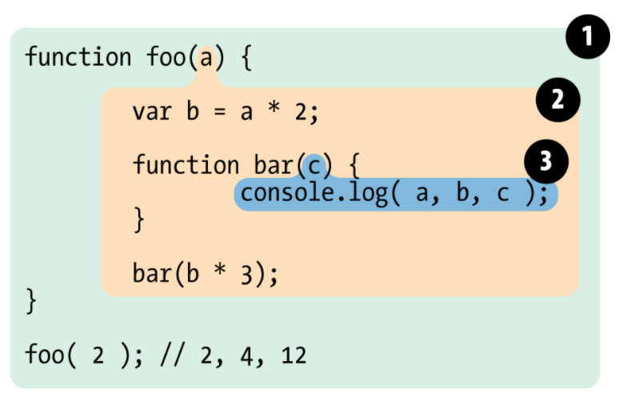

# 스코프(scope)란 무엇인가?

프로그래밍 언어에 있어서 가장 기초적인 개념중 하나가 값을 변수에 저장하고 나중에 그 값을 불러오고 수정할 수 있다는 것일 겁니다. 이러한 개념이 없었다면 아마 프로그램이 할 수 있는 것은 많이 없었을 것입니다. 

아마도 여러분은 이런 생각을 한 번쯤은 해봤을 건데요. 

> '변수는 도대체 어디에 생성되는 거지?' '프로그램이 변수를 어떻게 찾는거지?'

변수를 어떠한 위치에 저장할 때는, 사실 특정한 규칙을 따라서 저장을 합니다. 그리고 변수를 찾을 때도 그 규칙에 따라 변수를 찾죠. 우리는 이러한 규칙을 **스코프**라고 부릅니다.

이번 포스트에서는, 스코프가 어떻게 지정 되는지에 대한 자세한 원리가 아닌, 우리가 프로그램을 더 쉽게 짤 수 있게, 실용적인 면에 대해서 조금 더 집중해보도록 하겠습니다.

## 렉시컬 스코프(Lexical Scope)

제가 아까 '스코프(scope)'란 변수를 찾기 위한 규칙이라고 얘기하였습니다. 스코프에는 두 가지 주요한 모델이 있습니답. 첫번째로는 가장 많은 프로그래밍 언어에서 쓰이는 **렉시컬 스코프(Lexical Scope)**입니다. 두번째로는 몇몇 언어들에서 쓰이는 **다이나믹 스코프(Dynamic Scope)**가 있습니다. 

우리가 사용하는 자바스크립트는 렉시컬 스코프를 사용하는데요. 한 번 자세히 알아보겠습니다.
자바스크립트 언어는 실제로 컴파일 언어인데요. 보통 컴파일러들이 코드를 컴파일 할 때 가장 먼저 하는 것이 렉싱(lexing 혹은 토큰화(tokenizing))입니다. 

이 렉싱을 하는 과정에서 만들어지는 스코프가 **렉시컬 스코프**입니다. 쉽게 얘기하자면, 컴파일러가 여러분의 코드를 처리하면서 만들어내는 스코프이죠.

한 번 예시를 보겠습니다.

```javascript
function foo(a) {
    var b = a * 2;

    function bar(c) {
        console.log(a, b, c);
    }

    bar(b * 3);
}

foo(2);
```

위의 예시에서는 세 개의 중첩된 스코프가 있는데요. 스코프를 방울이라고 생각하시면 이해가 더 쉬울 수도 있을 것 같습니다.



**방울 1**는 글로벌 스코프에 속해있고, 한 개의 식별자만 있습니다: `foo`

**방울 2**는 `foo` 스코프에 속하는데, 3개의 식별자들이 있습니다: `a`, `bar`, `b`

**방울 3**는 `bar` 스코프에 속하는데, 1 개의 식별자가 있습니다: `c`


일단 아주 간단하게 함수는 새로운 스코프를 생성한다고 가정을 하겠습니다. 그렇다면, `bar` 방울은, `foo`의 방울안에 가둬져 있겠죠. 왜냐하면 `bar`가 `foo` 방울 안에서 선언이 되었으니까요.

그렇다면 위의 예시로 다시 돌아가서, `bar` 안의 `console.log(a, b, c)`를 한 번 살펴볼게요. 가장 먼저, `a`를 찾아야 하겠죠? 식별자를 찾을 때 가장 먼저 찾는 곳은, 가장 안쪽의 스코프부터 시작이 됩니다. 가장 안쪽의 방울은 `bar` 방울이니 그 안에서 `a`를 찾으려 할 겁니다. 하지만 찾을 수가 없네요. 그래서 이번에는 그것을 감싸고 있는 `foo` 방울에서 식별자를 찾으려 합니다. 여기서는 `a`를 찾을 수가 있죠? 그래서 그 `a`를 가지고 올 것입니다. `b`의 경우도 똑같죠. 

하지만 `c`는 다릅니다. `c`는 `bar` 방울 안에서 바로 찾을 수 있었기 때문에, 더 이상 다른 방울에서 찾아보지 않고 멈춰서 `bar` 방울 안의 `c`를 사용을 하죠.

그러면 우리는 여기서 식별자를 찾는 규칙을 알게되죠. **가장 안쪽의 스코프부터 시작해, 가장 바깥 쪽의 스코프로 나아가는 형식입니다. 그리고 중간에 식별자를 찾는다면, 그 행동을 멈추게 됩니다.**

### 연습문제:
```javascript
const student = () => {
    var name = 'hansol';
    var age = 29;
}
```

만약의 위의 `name`과 `age`라는 변수에 접근을 하고 싶다면 아래의 코드는 어디에 
들어가야 할까요?

```javascript
console.log(`저의 이름은 ${name}이고 나이는 ${age}입니다.!`);
```

- 렉시컬 스코프란 무엇인가요?
- 중첩 스코프가 있다면 엔진은 안에서 바깥으로 식별자를 찾게 되나요 바깥에서 안으로 식별자를 찾게 되나요?

## 함수 스코프 vs 블락 스코프

우리가 위에서 배웠듯이, 스코프는 식별자(변수, 함수)들이 선언된 공간을 얘기합니다. 우리는 이것을 방울에 비유했죠. 그리고 이러한 방울들은 다른 방울의 안에 중첩될 수 있다고도 배웠습니다. 그것이 중첩 스코프이고요.

그렇다면 자바스크립트에서는 어떠한 것들이 이러한 스코프를 생성할까요?

### 함수 스코프

먼저 아까 얘기하였듯이 함수는 스코프(방울)를 생성합니다. 그래서 여러분이 새로운 함수를 만들때마다 새로운 스코프를 생성하는 것이죠.

예시를 한 번 살펴볼게요.

```javascript
function student() {
    var name = 'Hansol';
    
    function sayName() {
        console.log(`제 이름은 ${name}입니다.`);
    }

    var age = 24;
}
```

위의 예시에서는 `student` 라는 함수가 있는데요. 그러면 이 함수는 새로운 스코프를 생성하겠죠. 그 스코프를 `student` 스코프라고 얘기하겠습니다.

그러면 이 `student` 스코프에는 세 개의 식별자가 있죠. `name`, `age`, 그리고 함수 `sayName` 입니다. 여기서 중요한 점은 함수 선언이나 변수 선언이 스코프 안에 어디에 있든, 그 변수나 함수는 선언된 스코프 안에 속한다는 것입니다.

`sayName` 함수도 자신만의 스코프를 가지고 있을 겁니다. 함수이니까요. 

그러면 제가 `student` 스코프 밖에서 스코프 안에 있는 식별자들에 접근을 하려면 무슨 일이 일어날까요?

```javascript
function student() {
    var name = 'Hansol';
    
    function sayName() {
        console.log(`제 이름은 ${name}입니다.`);
    }

    var age = 24;
}

sayName(); // ReferenceError: sayName is not defined
console.log(name); // ReferenceError: name is not defined
console.log(age); // ReferenceError: age is not defined
```

모든 것들이 다 오류가 나죠. 왜냐하면 이 식별자들은 `student` 스코프 안에 있는 식별자들이고 우리가 그것을 접근하는 곳은 글로벌 스코프이기 때문에, 접근이 불가능한 것입니다. 위에서 얘기하였듯이, 가장 안쪽에 있는 스코프에서 바깥의 스코프는 접근이 가능하지만, 바깥의 스코프에서 안쪽에 있는 스코프는 접근이 불가능합니다.

이러한 함수 스코프는, 모든 변수들이 그 함수 안에 속해있기 때문에 여러 곳에 유용하게 사용될 수 있습니다. 나중에 한 번 그 예시들을 보도록 할게요.

### 블록 스코프(Block Scope)

이제까지는 스코프를 생성하려면 함수를 쓰는 수 밖에 없었죠. 그리고 사실 함수 스코프가 자바스크립트 디자인에서 가장 많이 쓰입니다. 이렇게 스코프를 잘 이용하게 되면 조금 더 깔끔하고 유지보수가 쉬운 코드를 짤 수 있죠. 

하지만 스코프를 생성하는 데는 블록(Block) 이라는 것도 있습니다. 블록이란 어떤 것이든 `{...}` 안에 감싸져 있는 것을 하나의 블록이라고 얘기를 합니다. 이것도 스코프를 생성을 하죠.

한 번 예시를 볼게요.

```javascript
for (var count = 0; count < 10; count++) {
    console.log(count);
}
// 0, 1, 2, ....., 9

console.log(count); // 10
```

우리의 목적은 아마 `count` 라는 변수를 for 반복문에서만 쓰는 것일 것입니다. 하지만 반복문이 다 실행되고 나서도 우리는 `count` 변수에 접근을 할 수가 있습니다. 우리는 `count` 변수를 반복문에서만 쓰고 싶기 때문에 이렇게 글로벌 스코프를 더럽히는 일은 사실 좋지 않은 일이죠? 우리는 최대한 식별자를 원하는 스코프안에 숨기고 싶을 겁니다. 그래야 유지보수가 쉽고 더 깔끔한 코드를 작성할 수 있으니까요.
 
그렇다면 어떻게 `count` 변수를 for 반복문 안에서만 사용할 수 있을까요?

### let

ES6에서는 `var`와 함께 새롭게 변수를 선언하는 키워드인 `let`을 도입하는데요, 이것은 무엇을 하는 녀석일까요?

`let` 키워드가 하는 일은 변수를 자기 자신이 속한 어떠한 블록(`{}`)이던지 간에, 그 안에 자기 자신을 가둬버립니다.

```javascript
for (let count = 0; count < 10; count++) {
    console.log(count);
}
// 0, 1, 2, .... 9

console.log(count); // ReferenceError: count is not defined
```

위의 예시를 보시면, 더 이상 `count` 변수가 글로벌 스코프에서 접근을 할 수 없는게 보이시나요? 이것은 왜냐하면, `count` 변수가 `let`과 함께 선언이 되었기 때문에, for 반복문의 블록(`{}`)에 자기 자신을 가둬버렸기 때문이죠. 그래서, 글로벌 스코프에서는 더 이상 접근을 할 수가 없는 것 입니다.

### const

`let` 키워드와 `const` 라는 키워드도 있는데요. 이것도 블록 스코프 변수를 생성합니다. 하지만 이 변수의 값은 변할 수 없습니다(상수). 나중에 값을 변경하려 하면 오류가 생기죠.

```javascript
if (true) {
    const age = 24;
}

console.log(age); // ReferenceError: age is not defined
```

```javascript
if (true) {
    const age = 24;
    age = age + 1; // 에러!
}
```

### 정리

자바스크립트에서 함수는 스코프를 생성하는 가장 흔한 유닛입니다. 그리고 함수 안에 생성되는 또 다른 함수는 감싸고 있는 함수에 의해서 숨겨지게 되죠. 좋은 소프트웨어 디자인의 원칙이기도 합니다.

하지만 함수만이 스코프를 생성하는 것은 아닙니다. 블락 스코프도 있는데요. 블락 스코프란 변수나 함수가 어떠한 블락(`{...}`)에 속하게 되는 것을 얘기합니다.

## 호이스팅

지금 쯤이면 아마 여러분들은 스코프에 대해서 잘 이해를 하고 있다고 생각이 듭니다. 간단하게 정리하자면, 함수 스코프든 블락 스코프이든 그 스코프 안에서 생성 되는 변수들은 그 스코프에 속하게 된다는 규칙은 같습니다. 그런데 두 개 간의 아주 작은 차이가 있는데요. 한 번 살펴보겠습니다.

### 닭이 먼저일까 달걀이 먼저일까?

아마도 여러분은 여러분이 작성한 자바스크립트 코드가 위에서부터 아래로 한 줄 한 줄씩 실행된다고 생각하실 겁니다. 사실 이 말은 맞는 말이긴 하지만, 주의해야 할 점이 하나 있습니다.

```javascript
a = 2;

var a;

console.log(a);
```

위의 예시를 보면, 여러분은 `console.log` 문이 어떠한 결과물을 출력할 것이라 생각이 드나요?

`var a;`가 `a = 2;` 보다 늦게 선언이 되었기 때문에 아마도 많은 사람들이 `undefined` 를 생각할 것입니다. 하지만 실제로는 `2`가 출력이 됩니다.

또 다른 예시를 보시면,
```javascript
console.log(a);

var a = 2;
```

여러분은 어떤 것이 출력될 것이라고 생각하시나요? 아마도 먼저의 예시에서 `2`가 제대로 출력이 되었기 때문에 이번에도 `2`가 출력이 될 것이라 생각할 겁니다. 아니라면, `a`가 변수가 선언되기 전에 사용되었기 때문에 `ReferenceError`가 발생할 것이라고도 생각할 수 있습니다. 하지만, 둘 다 틀렸고 결과값은 `undefined`가 나옵니다.

**무슨 일이 일어난 걸까요?** 치킨(변수 선언)이 먼저일까요 달걀이(대입) 먼저일까요?

## 컴파일러 이론

이것을 이해하기 위해서는 약간의 학문적인 이론이 필요한데요. 여러분의 코드가 실행되기 전에 컴파일러라는 것이 자바스크립트 엔진이 코드를 실행할 수 있게 코드를 컴파일 시켜주는 과정이 있습니다.

<!-- 컴파일러와 자바스크립트 사진 넣기 -->

그래서 이것을 아주 이해하기 쉽게 하기위해서는, 여러분의 변수와 함수는 여러분의 코드가 실행되기 전에 먼저 선언된다고 생각을 하시면 됩니다.

여러분이 `var a = 2;`를 보시면 아마도 이것이 한 개의 구문이라고 생각하겠지만, 자바스크립트는 이것을 두 개의 구문으로 생각을 합니다: `var a;`와 `a = 2;`로요. 첫번째 구문은 선언문이고, 두번째 구문은 대입문이겠죠.

그래서 위의 첫번째 예시는 아마 이런 식으로 실행 되었을 겁니다.

```javascript
var a;

a = 2;

console.log(a);
```

그리고 두번째 예시는 이렇게 실행 되었겠죠.
```javascript
var a;

console.log(a);

a = 2;
```

이러한 절차를 한 번 비유적으로 이해해본다면, 변수와 함수 선언문들은 코드의 가장 맨 위로 옮겨진다고 생각을 하면 쉬울 것 같습니다. 그리고 이렇게 옮겨지는 과정을 우리는 '호이스팅(Hositing)' 이라고 하죠.

**다른 말로 해서 달걀(선언)이 치킨(대입)보다 먼저인 경우입니다.**

여기서 중요한 점은 선언문만 옮겨지는 것이지 값을 대입하는 논리들은 그 자리에 그대로 있습니다.

이 예시는,

```javascript
foo();

function foo() {
    console.log(a); // undefined

    var a = 2;
}
```

아마 이렇게 해석이 되겠죠.

```javascript
function foo() {
    var a;

    console.log(a);

    a = 2;
}

foo();
```

함수 선언문은 우리가 보다시피 호이스트 됩니다. **하지만 함수 표현식은 아닙니다.**
```javascript
foo(); // Uncaught TypeError: foo is not a function

var foo = function bar() {
    console.log('I cannot be hoisted');
};
```

보시면 식별자 `foo`는 감싸고 있는 스코프에 호이스팅 됩니다. 

```javascript
var foo;

foo(); // foo는 함수가 아닙니다!!

foo = function bar() {
    console.log('I cannot be hoisted');
}
```

아마 이런식으로 코드가 진행이 되었겠죠.

### 변수보다 함수가 먼저입니다

함수와 변수 선언문 둘 다 호이스팅 되는데 하지만 약간의 차이는 있습니다. 함수가 먼저 호이스팅되고 그 다음 변수가 호이스팅 됩니다.

```javascript
foo();

var foo;

function foo() {
    console.log(1);
}

foo = function() {
    console.log(2);
}
```

```javascript
function foo() {
    console.log(1);
}

var foo; // `foo`라는 식별자가 겹치기 때문에 무시됩니다.

foo();

foo = function() {
    console.log(2);
}
```

### 정리하자면...

우리는 보통 `var a = 2;`를 볼 때 한 개의 구문으로 보지만 자바스크립트 엔진은 그렇게 생각하지 않습니다. `var a;`와 `a = 2;`로 생각을 하게되죠. 첫번째 구문은 컴파일을 할 때 발생되고, 두번째 구문은 실행을 할 때 발생되죠.

이것이 무엇을 의미하냐면은 스코프안에 있는 모든 선언문은 어디에서 나타나든, 코드가 실행되기 전에 먼저 선언이 된다는 것입니다. 아마 이것을 코드의 맨 위로 옮겨진다고 생각을 하면 되는데, 이것을 **"호이스팅(Hoisting)"** 이라고 부릅니다.

함수 선언문은 호이스팅 되지만, 함수 표현식은 호이스팅 되지 않습니다!


