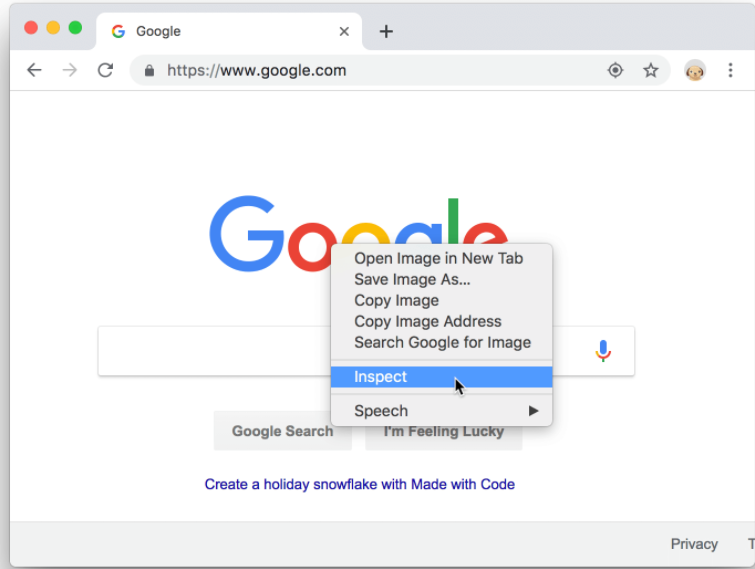
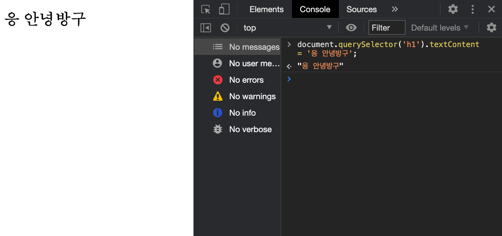
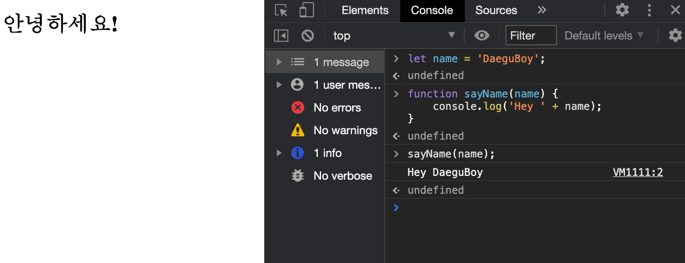

# 개발자 도구(Developer Tools)

- ~~Open DevTools~~
- CSS
    - Get Started with Viewing and Changing CSS
    - CSS Reference

- ~~Console~~
    - ~~Overview~~

- Mobile Simulation
    - Overview

- DOM
    - Get Started

- JavaScript
    - Get Started
    - Pause Your Code With Breakpoints

## 소개

구글 크롬, 파이어폭스, 사파리 등등 유명한 브라우저들에는 보통 웹 개발을 돕는 도구들이 있습니다. 이것을 개발자 도구라고 합니다. 개발자 도구는 HTML, CSS, 그리고 Javascript 등등을 검사하게 도와줍니다.

## 왜 개발자 도구를 알아야 할까요?

개발자 도구를 사용하는 법을 아는 것은 웹 개발자에게 아주 중요한 기술입니다. 개발자 도구를 통해서, 이슈와 버그의 원인을 쉽게 찾아낼 수 있습니다. 만약, 몇 시간이 걸리는 디버깅이였다면 개발자 도구를 통하여 이것을 금방 끝낼 수도 있죠.

개발자 도구가 우리에게 주는 이점에 비해, 개발자 도구를 사용하는 법을 배우는 것은 크게 어렵지 않습니다. 조금만 연습을 하시면, 아주 편하게 개발자도구를 사용하실 수 있으실 겁니다.

## 개발자 도구 열기

우리는 보통 사람들이 사용하는 웹 브라우저인 크롬의 개발자도구를 배워보겠습니다. 개발자 도구를 여는 방법에는 여러가지가 있습니다.

### 1. 검사하기(Inspect)를 통하여 열기

브라우저에서 마우스 오른쪽을 클릭하여, 검사하기 버튼을 눌러주시면 개발자도구가 나타날 것입니다.

*photocredit: google*


### 2. 콘솔 패널 바로 열기

개발자 도구에서 콘솔 패널을 바로 여시려면,

- 맥: Command + Option + C
- 윈도우: Control + Shift + C

을 눌러주시면 됩니다.

### 3. 마지막으로 열려있던 패널 열어주기

여러분이 마지막으로 있었던 패널을 열어주려면,

- 맥: Command + Option + I
- 윈도우: Control + Shift + I

를 눌러주시면 됩니다.

### 4. 크롬의 메인 메뉴를 통해 열기

크롬의 오른쪽 위 상단에 있는 3개의 점을 클릭해주시고, More tools > Developer Tools를 클릭하여 열어주셔도 됩니다.

*photocredit: google*

## 콘솔 사용하기

개발자 도구에서, 콘솔은 2가지 주요한 기능을 가집니다.

- 기록된 메세지 보기
- 자바스크립트 실행하기

### 기록된 메세지 보기

보통 웹 개발자들은, 자바스크립트가 제대로 작동되었는지 보려고 `console.log` 를 통하여 메세지를 기록합니다.

```javascript
console.log('Hello, Console!');
```

브라우저에서 여러분의 자바스크립트 코드를 실행시켰을 때, console.log가 있다면 브라우저는 콘솔에 그 메세지를 기록을 해 줄 것입니다. 

예를 들어서, 여러분이 페이지를 만들기 위해서 HTML과 Javascript를 쓰고 있다고 생각해볼게요.

```javascript
<!doctype html>
<html>
  <head>
    <title>Console Demo</title>
  </head>
  <body>
    <h1>안녕하세요</h1>
    <script>
      console.log('로딩중!');
      const h1 = document.querySelector('h1');
      console.log(h1.textContent);
      console.assert(document.querySelector('h2'), 'h2을 찾을 수 없습니다');
      const artists = [
        {
          first: '지영',
          last: '백'
        },
        {
          first: '범수',
          last: '김'
        },
        {
          first: '희열',
          last: '유'
        }
      ];
      console.table(artists);
      setTimeout(() => {
        h1.textContent = 'Hello, Console!';
        console.log(h1.textContent);
      }, 3000);
    </script>
  </body>
</html>
```

위의 코드에서 3가지의 콘솔 메쏘드를 썼는데요.

- `console.log(객체)` 는 어떠한 객체를 콘솔에 기록하여 줍니다.

- `console.assert(표현식, 객체)` 는 어떠한 표현식이 false값이라면, 에러를 콘솔 창에 기록하여 줍니다. 위에서는 h2라는 객체를 찾을 수 없었기 때문에 h2를 찾을 수 없었다는 에러를 기록하죠.

- `console.table(배열)`는 배열을 테이블 형태로 나타내줍니다. 위에서는 artist를 테이블 형태로 나타내어주죠.

메세지를 기록하는 법에 대해서 더욱 더 자세하게 알고 싶으시다면, [콘솔 API](https://developers.google.com/web/tools/chrome-devtools/console/api) 를 보시면 됩니다.

### 자바스크립트 실행하기

여러분은 콘솔에서 자바스크립트를 바로 실행하여 보실 수 있습니다. 아주 편리하죠. 예시의 HTML 파일을 한 번 보겠습니다.

```HTML
<!doctype html>
<html>
  <head>
    <title>Console Demo</title>
  </head>
  <body>
    <h1>안녕하세요!</h1>
  </body>
</html>
```

이러한 파일이 있다면, 콘솔 창에서 자바스크립트를 이용하여 바로 HTML의 내용을 바꿔줄 수도 있습니다.



여러분이 만약 HTML과 관련 없는 자바스크립트 코드라도, 그냥 편하게 실행을 해 보실 수 있습니다.




