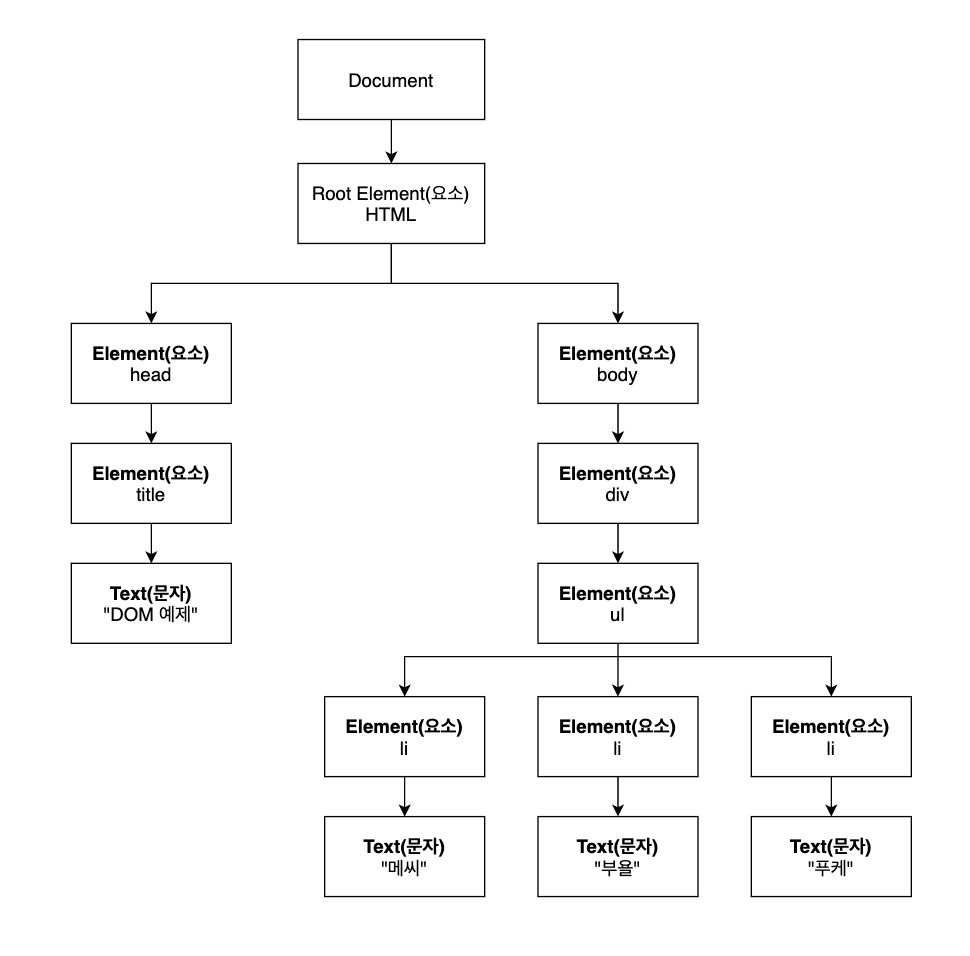

# DOM(Document Object Model - 문서객체모델) 다루기

<!--

- What is DOM in relation to a webpage?

- What's the difference between a "node" and an "element"?

- How do you target nodes with "selectors"?

- What are the basic methods for finding/adding/removing and altering DOM nodes?

- What is the difference between a "nodelist" and an "array of nodes"?

- How do "events" and "listeners" work? What are three ways to use events in your code?

- How does "bubbling" work?

-->

- DOM(Document Object Model) 소개
- 노드에 접근을 하는 방법들(CSS 선택자, 관계형 선택자)

## DOM(Document Object Model - 문서객체모델) 소개

자바스크립트의 가장 강력한 기능 중 하나는, 웹 페이지를 동적으로 구현할 수 있다는 것입니다. 예를 들어, 우리가 인터넷으로 옷을 살 때 장바구니에 담아서 결제를 하는 과정, 아니면 유튜브에 들어가서 댓글을 단다던지, 이렇게 우리가 웹 페이지와 동적인 소통을 할 수 있는 것은 자바스크립트 덕분입니다.

자바스크립트는 웹 페이지의 내용을 수정하거나, 추가하거나 변경할 수 있습니다. 하지만, 이렇게 하기 위해서는 웹 페이지에 대한 접근이 필요한데, 그것을 **DOM(Document Object Model)** 이라는 녀석이 제공을 합니다. 

예를 들어서, 여러분이 구글 크롬으로 네이버 홈페이지로 이동을 하였습니다. 구글 크롬(브라우저)은 네이버 페이지의 내용을 여러분이 볼 수 있게 로딩을 할 때, 그 페이지의 DOM을 생성합니다. 그 DOM은 HTML 문서를 표현하는 API이죠. 

DOM은 HTML 문서와 자바스크립트가 서로 상호작용을 할 수 있게 도와주는 매개체라고 생각하시면 됩니다. DOM 안에는 HTML의 내용들이 트리(tree) 구조로 생성이 되는데 이것을 우리는 **DOM tree** 라고 부릅니다. 이 DOM tree는 **노드** 라는 것들로 구성이 되어있는데, 이 노드는 HTML의 요소(태그), 주석, 문자 등 어떤 것이 될 수도 있습니다.

그러면, 한 번 HTML 예시를 보면서 DOM TREE를 더 잘 이해해보도록 할게요.

```html
<!DOCTYPE html>
<html lang="en">
<head> 
  <title>Document</title>
</head>
<body>
  <div>
    <ul>
      <li>메씨</li>
      <li>부욜</li>
      <li>푸케</li>
    </ul>
  </div>
</body>
</html>
```



위의 HTML 파일을 브라우저가 불러들일 때, 위의 그림과 같은 DOM 트리를 형성하게 됩니다. 아까 얘기하였듯이, 각각의 박스들은 노드라고 불리는 객체입니다. 이 노드는 요소(Element)가 될 수도 있고, 문자(Text)가 될 수도 있죠. 

예를 들면, `html`, `body`, `div`, `ul` 등등은 요소(Element)이고, `메씨`, `부욜`, `푸케`는 문자(Text) 입니다. 그래서 가장 위에 있는 노드는 항상 `document` 노드가 되겠죠. 

그리고 여기서 아셔야 할 점은, HTML과 비슷하게, 부모와 자식개념이 있습니다. 그래서 `document` 라는 노드는 모든 노드들의 **부모 노드(parent node)**입니다. 그리고 그 부모 노드의 바로 밑에 있는 것들을 **자식 노드(child node)**라고 얘기하기도 합니다. 만약에, 부모 노드가 한 개의 자식 노드말고 여러 개의 자식 노드를 가지고 있다면 그것들은 **형제 노드(sibling node)**라고 불리웁니다.

어때요, HTML과 완전 비슷하지 않나요? 그래서 쉽게 정리를 하자면, 문서객체모델(DOM)이라는 것은, HTML을 위한 프로그래밍 인터페이스입니다. 프로그램이나 스크립트 언어 같은 것들에 접근에 문서를 편집하고 수정하는 권한을 주는 것이죠.

쉽게 말하면 DOM은 HTML을 수정, 참조, 삭제 하기 위한 표준입니다.

## 노드에 접근을 하는 방법들(CSS 선택자, 관계형 선택자)

DOM에 대한 기초를 알아보았으니, 이제 DOM을 이용해서 어떻게 HTML과 소통을 할 수 있는지 알아봅시다. HTML 요소들과 상호작용을 하기 위해서는 먼저 HTML 요소에 접근을 하는 방법부터 알아야겠지요. HTML 요소에 접근을 하는 방법에는 2가지 방법이 있습니다.

- CSS 선택자(CSS Selectors)
- 관계형 선택자(Relational Selectors)

**CSS 선택자**

CSS 선택자 문법은 css에서 사용되는 문법으로 어떠한 요소에 스타일을 줄 때 사용이 되죠.

- 태그(Tag): 선택자 `p`는 `<p></p>` HTML tag를 찾습니다.

- 클래스(Class): 선택자 `.myDiv`는 `class="myDiv"`라는 값을 가진 모든 원소를 찾습니다.

- 아이디(Id): 선택자 `#list`는 `id=list` 라는 값을 가진 원소를 찾습니다.

**관계형 선택자**

관계형 선택자는 노드간의 관계를 통해 DOM 트리를 탐색할 수 있는 방법을 제공합니다. 이러한 관계들은 노드의 속성으로 저장되어 있습니다. 노드에 속한 아래의 속성들을 이용하여 우리는 DOM 트리를 탐색할 수 있습니다.

- `parentNode`
- `firstChild`
- `lastChild`
- `nextSibling`
- `previousSibling`

## CSS 선택자로 노드에 접근하기

원소를 선택하는 두 가지의 방법을 알아보았으니 이제는 실제로 주어진 방법을 이용하여 노드에 접근을 하여 볼게요. 아까 얘기하였듯이, `document` 객체는 DOM 트리에서 항상 최상단에 위치한 객체입니다. 그러므로 다른 객체들에 접근을 하려면 먼저 `document` 객체에 접근을 하여야 합니다.

DOM 인터페이스는 웹 페이지를 자바스크립트로 조작하기 위한 속성과 메쏘드들을 제공합니다. 가장 먼저, `.querySelector()` 메쏘드에 대해서 한 번 알아보겠습니다. `.querySelector()` 메쏘드는 주어진 선택자에 맞는 첫번째 원소를 반환합니다. 만약, 어떠한 원소도 주어진 선택자와 매칭이 되지 않는다면 `null`을 반환하죠.

`.querySelector()` 메쏘드는 CSS 선택자를 인수로 받기 때문에 가장 일반적으로 많이 쓰입니다. 왜냐하면 태그, 클래스, 그리고 아이디 등 어떤 것을 사용하여도 원소에 접근을 할 수 있기 때문이죠. 아주 유연합니다.

아까의 예제를 조금 바꿔서 한 번 보겠습니다.

```html
<!DOCTYPE html>
<html lang="en">
<head>
  <meta charset="UTF-8">
  <meta name="viewport" content="width=5, initial-scale=1.0">
  <title>Document</title>
</head>
<body>
  <div>
    <ul class="player-list">
      <li id="mesi" class="player">메씨</li>
      <li id="buyol" class="player">부욜</li>
      <li id="puque" class="player">푸케</li>
    </ul>
  </div>
</body>
<script src="script.js"></script>
</html>
```

```javascript
const playerList = document.querySelector(".player-list");

console.log(playerList);
// <ul class="player-list">...</ul>
```

위의 예제에서는 `class="player-list"` 라는 값을 가진 가장 첫번째 원소를 찾을 것입니다. 그리하여, `playerList`를 확인해보면 `class="player-list"` 값을 가진 `ul` 태그가 반환되신 것을 확인하실 수 있습니다.

아니면, CSS 선택자를 통하여 매칭되는 ID를 찾아 원소를 찾아낼 수도 있습니다.

```javascript
const mesi = document.querySelector("#mesi");

console.log(mesi);
// <li id="mesi">...</li>
```

만약에 주어진 CSS 선택자와 매칭이 되는 모든 원소를 찾고 싶다면 `.querySelectorAll()` 메쏘드를 사용하여 주시면 됩니다. `.querySelectorAll()`는 CSS 선택자와 매칭이 되는 모든 원소들을 노드 리스트로 반환을 하여 줄 것입니다.

```javascript
const players = document.querySelectorAll(".player");

console.log(players);
// NodeList(3) [li#mesi.player, li#buyol.player, li#puque.player]
```

<!-- 제목을 바꿔야 할 듯 싶다 -->
## CSS 기본 메쏘드로 노드에 접근하기

자바스크립트는 DOM 노드를 선택하기 위한 또 다른 메쏘드들을 제공합니다.

- `.getElementsByTagName(tagName)`: 태그 이름을 인수로 받아, 매칭되는 HTML 태그들을 반환합니다.
- `.getElementbyId(id)`: id를 인수로 받아서, 주어진 id와 매칭되는 id의 속성 값을 가진 원소를 반환합니다. 
- `.getElementsbyClassName(names)`: 클래스 이름을 인수로 받아서, `class`의 속성 값이 주어진 클래스 이름과 
같은 원소들을 찾아 반환합니다.

그러면 예시를 들어서 한 번 사용을 해보겠습니다.

```html
<!DOCTYPE html>
<html lang="en">
<head>
  <meta charset="UTF-8">
  <meta name="viewport" content="width=5, initial-scale=1.0">
  <title>Document</title>
</head>
<body>
  <div>
    <ul class="player-list">
      <li id="mesi" class="player">메씨</li>
      <li id="buyol" class="player">부욜</li>
      <li id="puque" class="player">푸케</li>
    </ul>
  </div>
</body>
<script src="script.js"></script>
</html>
```

만약, `li` 라는 태그를 모두 찾고 싶다면 `.getElementsByTagName()` 메쏘드를 사용하면, 주어진 태그에 맞는
모든 태그를 찾아낼 것입니다.

```javascript
const allLis = document.getElementsByTagName("li");

// HTMLCollection(3) [li#mesi.player, li#buyol,player, li#puque.player]
```

<!-- 더 좋은 설명 필요 -->
이번에는 특정한 ID 값을 가진 원소를 찾아보겠습니다. `getElementById()` 메쏘드를 써주시면 됩니다. 위의 것과
달리 이번에는 한 개의 원소만 반환하는데 왜냐하면 id 속성 자체가 오직 하나의 값만 가질수 있도록 디자인 되었기 때문입니다.

```javascript
const myFavoritePlayer = document.getElementById("mesi");

// <li id="mesi" class="player">메씨</li>
```

아니면 `.getElementsbyClassName()` 메쏘드를 써서 특정한 클래스 값을 가진 원소들을 찾을 수도 있습니다.

```javascript
const allPlayers = document.getElementsByClassName('player')

// HTMLCollection(3) [li#mesi.player, li#buyol,player, li#puque.player]
```

## 관계형 선택자로 노드에 접근하기

또 다른 방법으로 우리는 관계형 선택자를 사용하여서 노드에 접근할 수 있습니다. 관계형 선택자는 말 그대로 노드간의 관계를 이용하여
DOM Tree를 돌아다니는 방법입니다. 이러한 관계형 선택자들은 노드안에 프로퍼티로 저장되어 있습니다.

예시를 통해서 실제로 사용하여 보면서 관계형 선택자를 이해해볼게요.

```html
<!DOCTYPE html>
<html lang="en">
<head>
  <meta charset="UTF-8">
  <meta name="viewport" content="width=5, initial-scale=1.0">
  <title>Document</title>
</head>
<body>
  <div>
    <ul class="player-list">
      <li id="mesi" class="player">메씨</li>
      <li id="buyol" class="player">부욜</li>
      <li id="puque" class="player">푸케</li>
    </ul>
  </div>
</body>
<script src="script.js"></script>
</html>
```

먼저, `div` 노드에 한 번 접근하여보겠습니다. 

```javascript
const div = document.querySelector('div');
```

그리고 `parentNode` 라는 프로퍼티를 사용하여 `div`의 부모노드를 살펴볼게요.

```javascript
console.log(div.parentNode);

// <body>...</body>
```

`div` 의 바로 위에 있는 부모노드는 `body`이죠? 그래서 확인을 해보시면 `body`를 반환하시는 것을 볼 수 있습니다. 

부모노드를 확인할 수 있는 방법이 있으면 자식노드를 확인할 수 있는 방법도 있어야겠죠? `childNodes` 를 통해서 자식노드들도 확인을 할 수 있습니다.

```javascript
const playerList = document.querySelector('.player-list');
console.log(playerList.childNodes);

// NodeList(7) [text, li#mesi.player, text, li#buyol.player, text, li#puque.player, text]
```

`childNodes`는 모든 노드들을 `NodeList` 라는 배열과 비슷한 형태로 반환을 합니다. 하지만 배열이 아니라 배열이 가진 메쏘드들을 사용하지는 못합니다.

만약에, 여러분이 `text` 노드 등에는 큰 관심이 없고 `element` 타입의 노드만 반환을 하시고 싶다면 `children` 프로퍼티를 사용하여 주시면 됩니다.
여기서 말하는 `element` 타입의 노드란 `p`, `div`, `body` 등과 같은 우리가 알고 있는 HTML 원소를 얘기합니다.

```javascript
const playerList = document.querySelector('.player-list');
console.log(playerList.children);

// HTMLCollection(3) [li#mesi.player, li#buyol,player, li#puque.player]
```

`lastChild` 프로퍼티를 이용하여, 어느 노드의 마지막 노드를 반환할 수도 있습니다. 반대로, `firstChild` 프로퍼티를 이용하여
첫번째 노드를 반환할 수도 있겠죠.

```javascript
const playerList = document.querySelector('.player-list');

console.log(playerList.firstChild); // 
console.log(playerList.lastChild);
```

<!-- 예제에 관련된 그림과 마무리 -->

## DOM 메쏘드들

위에서도 얘기하였듯이 여러분의 브라우저가 페이지를 여러분에게 보여주기 위해서 HTML 코드를 DOM(문서객체모델)로 생성을 합니다. 이 HTML 코드와 DOM의 가장 큰 차이점은 DOM 안에 있는 객체인 노드들이 많은 프로퍼티와 메쏘드를 가지고 있다는 것입니다. 이 프로퍼티와 메쏘드를 통해서 우리는 웹 페이지를 자바스크립트로 조작을 할 수 있습니다.

실제로 HTML 예시와 함께 DOM의 여러가지 프로퍼티와 메쏘드 등을 상황에 맞게 사용해보겠습니다.

아래의 `index.html` 파일을 만들어주세요.

```html
<!DOCTYPE html>
<html lang="en">
<head>
  <meta charset="UTF-8">
  <meta name="viewport" content="width=5, initial-scale=1.0">
  <title>Document</title>
</head>
<body>
  <div></div>
<script src="script.js"></script>
</html>
```

`body` 태그 안에, 하나의 `div` 태그만 있습니다.

**요소(element) 생성하기**

`document.createElement(태그이름)` 은 태그이름에 맞는 요소를 생성합니다.
그럼 `ul` 요소를 한 번 생성해볼까요?

```javascript
const ul = document.createElement('ul');
```

이렇게 하면 `ul` 요소가 생성이 되는데 중요한 건 이 새로운 요소가 DOM 안에 들어가 있지 않습니다. 그냥 메모리에만 생성될 뿐이죠. 그래야 페이지에
올리기 전에 이 요소를 스타일을 추가한다거나, 클래스를 추가한다던지 등등의 조작을 할 수 있겠죠.
만약에 여러분이 DOM 안에 넣어주고 싶다면 아래의 메쏘드를 써주시면 됩니다.

**요소(element) 넣어주기**

`parentNode.appendChild(자식노드)`는 **자식노드**를 **부모노드**에 넣어줍니다.
HTML 파일 안에 있는 `div` 요소에 아까 생성한 `ul` 요소를 넣어주겠습니다.

```javascript
const div = document.querySelector('div');
div.appendChild(ul);
```

**요소(element) 지워주기**

`parentNode.removeChild(자식노드)`는 지정된 **자식노드**를 **부모노드**에서 지워줍니다.
그런데 생각해보니 이 `ul`이 필요없을 것 같아, `ul`을 지워주겠습니다.

```javascript
const div = document.querySelector('div');
div.removeChild(ul);
```

그리고 다시 HTML을 확인해보시면, `div` 태그 안에 아무것도 없는 게 보이실 겁니다.

**요소(element) 세부사항 조작하기**

이렇게 요소를 넣어주고 지워주기만 한다면 큰 의미가 없겠죠? 만약에 DOM의 어떤 HTML 요소에 대해서 자바스크립트가 알고 있다면, 여러분은 속성을 추가-삭제-수정 한다던지,
클래스를 바꿔준다던지, CSS 스타일링을 자바스크립트로 직접 해준다던지 많은 것들을 할 수 있습니다.

그렇다면 실제로 한 번 `div` 요소에 CSS 인라인 스타일링을 조금 해줄게요.

**CSS 인라인 스타일 추가하기**

```javascript
const div = document.querySelector('div');

div.style.height = '500px';
div.style.width = '500px';
// div의 높이와 넓이를 500px로 지정

div.style.backgroundColor = "gray";
// div의 배경을 회색으로 지정
```

위에서는 `div` 요소를 선택하여, 거기에 대한 스타일링을 해주었습니다. 여기서 주의하셔야 할 점이 두 개 있는데 첫번째로는 `style` 이라는 프로퍼티를 먼저 적어주셔야 그 다음 CSS 프로퍼티를 사용하실 수 있습니다. 

위의 예시를 보시면 `HTMLElement.style.backgroundColor` 형식으로 되어있죠.
또 하나의 주의할 점은 보통 CSS 프로퍼티는 케밥 케이스(`background-color`)를 사용하는데, 자바스크립트로 스타일링을 하실때는 카멜 케이스(`backgroundColor`)를 사용하시거나 브라켓 표기법(`HTMLElement.style["background-color")`)을 사용하셔야 됩니다.

```javascript
div.style.background-color // X
div.style.backgroundColor // O(카멜케이스)
div.style["background-color"] // O(브라켓 표기법)
div.style.cssText = "background-color: black"; // O
```

DOM의 CSS 스타일 룰에 대해서 알고싶다면, [CSS 스타일 룰 섹션](http://domenlightenment.com/#6.2)을 한 번 들어가보시는 것도 추천드립니다.

**속성(Attribute) 수정하기**

자바스크립트에서 HTML 속성을 수정할 수도 있습니다.

```javascript
div.setAttribute('id', 'container'); // id 속성의 값을 `container`로 줌

div.getAttribute('id'); // id 속성의 값을 반환. 'container'

div.removeAttribute('id'); // id 속성을 지움
```

**클래스(class) 조작하기**

```javascript
div.classList.add('main'); // `main` 이라는 클래스를 div에 추가

div.classList.remove('main'); // `main` 이라는 클래스를 div에서 제거

div.classList.toggle('main'); // 'main' 이라는 클래스가 있다면 제거, 없다면 추가
```

**텍스트 추가하기**

```javascript
div.textContent = '안녕하세요 여러분!';
// '안녕하세요 여러분' 이라는 값을 가진 텍스트 노드를 생성하여 div에 추가
```

**HTML 추가하기**

```javascript
div.innerHTML = '<span>안녕하세요 여러분!</span>';
// div에 HTML을 추가함
```

**텍스트를 추가하기 위해서는 보통 `textContent`가 많이 쓰입니다. `innerHTML`은 보안상 문제를 일으킬 수 있기 때문에 최대한
적게 쓰시는 게 좋습니다.*

**정리**

다음으로 넘어가기 전에 우리가 이때까지 배운 것을 한 번 복습해볼게요. 아래의 예시를 보겠습니다.

```html
<body>
  <h1>
    연습용 웹페이지
  </h1>
  <div id="container"></div>
</body>
```

```javascript
// 자바스크립트 파일
const container = document.querySelector('#container');

const content = document.createElement('div');
content.classList.add('content');
content.textContent = '저는 텍스트 노드입니다!';

container.appendChild(content);
```

자바스크립트에서 저희는 먼저 `container` div에 대한 정보를 참조합니다. 그 다음, 우리는 새로운 div를 만들어 `content` 라는 변수에 넣어주죠. 그 다음에는 `content` 라는 클래스를 추가하고, 거기에 텍스트 노드를 넣어줍니다. 여러분의 자바스크립트 코드가 실행되고 나면, DOM 트리는 아마 아래의 예시와 같을 것입니다.

```html
<!-- DOM 트리 -->
<body>
  <h1>
    연습용 웹페이지
  </h1>
  <div id="container">
  	<div class="content">
      저는 텍스트 노드입니다!
    </div>
  </div>
</body>
```

여러분 그런데 명심하셔야 될 것은 자바스크립트가 HTML 파일을 바꾸어 주는 것이 아니라 DOM을 바꾸어주는 것입니다. HTML 파일은 아마 똑같을 것이고 브라우저가 렌더링 하는 웹페이지를 바꾸어 줄 것입니다.

**중요한 점**: 여러분의 자바스크립트 파일은 보통 HTML에서 script 태그를 만났을 때 실행될 것입니다. 만약에 여러분이 자바스크립트 파일을 HTML 파일의 위에 포함을 시키신다면 많은 DOM 메쏘드나 프로퍼티들이 작동을 하지 않을 수 있습니다. 왜냐하면 자바스크립트 코드가 DOM 노드가 생성되기 전에 작동하기 때문이죠. 그러니 HTML 파일의 밑에 자바스크립트 파일을 포함시키시는 것이 좋습니다.

### 연습

이제 배운 것을 연습해볼까요? 바로 위의 예시를 VSCode나 여러분이 사용하는 에디터에서 열어주세요. 하나의 HTML파일과 하나의 자바스크립트 파일이 있어야겠죠? 그 다음 밑의 요소들을 **자바스크립트만** 이용하여 `container` div에 넣어주세요.

1. `<p>` 와 "나는 빨간색이야" 라는 빨간 색상의 텍스트
2. `<h3>` 와 "나는 h3 파란색이야" 라는 파란 색상의 텍스트
3. 노란 배경과 검정색의 테두리를 가지고 있는 `<div>`. 그 안에는 아래의 요소들이 있음
  1. "나는 div 안에 있다!" 라는 텍스트를 가진 `<h1>`
  2. "나도" 라는 텍스트를 가진 `<p>`


## 이벤트(EVENT)

<!-- 
DOM을 다이나믹하게 발생시키는 3가지 방법
여러가지의 노드에 이벤트 리스너 추가하는 법
 -->
우리는 자바스크립트를 통해서 어떻게 DOM을 조작하는지 배웠습니다. 다음은 이것을 어떻게 특정 시점에 맞춰서 다이나믹하게 조작하는 지 알아볼려고 합니다. **이벤트**라는 것을 통해서 우리는 다양한 DOM 메쏘드 등을 다이나믹하게(동적으로) 쓸 수 있는데요. 이벤트라는 것은 여러분의 페이지에 일어나는 사건 같은 것들입니다. 예를 들어서 마우스 클릭, 키보드 누름 등등이 있겠죠. 자바스크립트를 이용해서 우리 웹페이지를 이러한 이벤트를 듣고, 거기에 반응하게 해볼게요.

### 이벤트를 추가하는 3가지 방법

우리는, 어떤 버튼이 클릭되면 "안녕하세요!"를 출력하는 버튼을 만들 것입니다. VS Code에서 실행하며 따라해보시거나, 온라인 에디터 [코드펜](https://codepen.io/)등을 사용하셔도 됩니다.

**방법1: HTML 요소에 함수속성 추가하기**

첫번째 방법은 HTML 요소에 함수속성을 직접 추가하는 것입니다. 

```html
<button onclick="alert('안녕하세요!')">Click Me</button>
```

이 방법은 아주 좋은 방법은 아닙니다. 왜냐하면 HTML 파일을 **더럽히고** 있기 때문이죠. HTML 파일은 HTML에 관련된 코드만 있으면 가장 좋습니다.결론은 사용하지 마세요.

**방법2: DOM 객체에 on_event 프로퍼티에 함수 추가하기**

event handler properties
두번째 방법은 자바스크립트에서, DOM 객체의 `onevent` 프로퍼티에 함수를 넣어주는 것입니다.

```html
<!-- HTML 파일 -->
<button id="btn">Click me</button>
```

```javascript
// 자바스크립트 파일
const btn = document.querySelector('#btn');
btn.onclick = () => alert("Hello World");
```

이거는 약간 낫습니다. 왜냐하면 자바스크립트를 HTML에서 지워줬기 때문이죠. 하지만 이것도 좋은 방법은 아닙니다. 왜냐하면 DOM 객체가 하나의 'onclick' 프로퍼티밖에 가질 수 없기 때문이죠.

**방법3: addEventListener 사용하기**

```html
<!-- HTML 파일 -->
<button id="btn">Click me</button>
```

```javascript
// 자바스크립트 파일
const btn = document.querySelector('#btn');
btn.addEventListener('click', () => {
  alert("안녕하세요!");
})
```

마지막 방법은 `EventTarget.addEventListener`를 사용하는 것인데, 이를 통해서 우리는 자바스크립트와 HTML을 분리하였고, 만약에 필요하다면 여러개의 이벤트 리스너를 추가할 수 있습니다.

그리고 위의 예시에서 저는 화살표 함수만을 썼지만, 함수라면 그 어떤 것도 상관이 없습니다. 이름있는 함수를 써도 됩니다.

예를 들어,

```html
<!-- HTML 파일 -->
<button onclick="alertFunction()">CLICK ME!</button>

```
<!-- 자바스크립트 -->
```javascript
function alertFunction() {
  alert('안녕하세요~!');
}

// 방법2
btn.onclick = alertFunction;

// 방법3
btn.addEventListener('click', alertFunction);
```

만약에 이름있는 함수를 쓴다면 여러분은 코드를 좀 더 깔끔하게 작성할 수도 있습니다. 만약에 여러분이 특정 함수를 여러번 써야 된다면 이름 있는 함수를 쓰는게 **정말 좋은 생각**입니다.

**이벤트에 대한 정보 얻기**

가끔씩은, 여러분이 이벤트 그 자체에 대한 정보를 얻어야 될 때도 있습니다. 여러분이 실행시키려는 함수에, 매개변수를 넣어준다면 그 매개변수를 통해 우리는 이벤트 자체에 대한 정보를 더 얻을 수도 있습니다. 말로 하면 어려우니 예시를 볼게요.

```javascript
btn.addEventListener('click', function(e) {
  console.log(e);
});
```

**노트: 위에서의 함수 `function(e)`는 addEventListener의 콜백입니다. 콜백이란 아주 쉽게 말하자면 함수의 매개변수에 인수로써 넘겨주는 함수를 칭합니다. 콜백은 자바스크립트에서 아주 중요한 개념이기 때문에, 아래의 영상을 보시는 것을 추천드립니다*

- [드림코딩 by 엘리의 콜백 이해하기, 콜백 지옥체험](https://www.youtube.com/watch?v=s1vpVCrT8f4&ab_channel=%EB%93%9C%EB%A6%BC%EC%BD%94%EB%94%A9by%EC%97%98%EB%A6%AC)

위의 예시에서 함수의 매개변수 `e`는 이벤트를 참조하는 객체입니다. 이 객체안에 여러가지 유용한 프로퍼티와 함수 등이 있습니다. 예를 들어서 어떤 키가 클릭이 되었는지, 어떤 이벤트 타겟이 클릭되었는지 등등이 있습니다(클릭된 DOM노드).

밑의 코드를 한 번 실행해보세요.

```html
<!-- HTML -->
<button id="btn">Click me</button>
```

```javascript
// 자바스크립트
const btn = document.querySelector('#btn');
btn.addEventListener('click', function (e) {
  console.log(e.target); // "<button id='btn'>Click me</button>"
});
```

그리고, 밑의 코드를 실행해보세요.

```javascript
btn.addEventListener('click', function (e) {
  e.target.style.background = 'blue';
})
```

짜잔, 신기하지 않나요? ㅎㅎ

## 노드 그룹에 이벤트 리스너 추가하기

이때까지는 한 개의 노드에 이벤트에 반응을 할 수 있게 하는 이벤트 리스너를 추가하였습니다. 하지만 여러가지 노드에 이벤트 리스너를 추가해야 된다면 어떻게 해야될까요? 

```html
<div id="container">
    <button id="1">Click Me</button>
    <button id="2">Click Me</button>
    <button id="3">Click Me</button>
</div>
```

위의 예시에서는 3가지 버튼이 있습니다. 하지만, 버튼을 하나하나씩 참조한다음 이벤트리스너를 추가해준다면 엄청 비효율적이겠죠. 우리는 `document.querySelector()`를 이용해 (노드리스트`NodeList`)를 받는 방법을 알고 있습니다. 그리고 반복을 이용해주면 조금 더 깔끔하게 이벤트 리스너를 추가해 줄 수 있습니다.

```javascript
// buttons 변수는 노드리스트입니다. 배열은 아니지만 `forEach`를 사용하여 반복을 해 줄 수 있습니다.
const buttons = document.querySelectorAll('button');

// forEach를 통해 모든 버튼에 접근할 수 있습니다.
buttons.forEach((button) => {

  // 각각의 버튼에 'click' 이벤트에 대한 리스너를 추가합니다.
  button.addEventListener('click', () => {
    alert(button.id);
  })
})
```

제가 위에서 다룬 예시는 DOM 조작에 있어 아주 극히 일부분에 불가하지만, 여러분이 연습을 해나가는데는 충분할 것 같습니다. 위의 예시들에서는 'click' 이벤트에 대해서만 다루었지만, 다양한 이벤트들이 있습니다.

예를 들어서,

- click(마우스 클릭)
- dblclick(마우스 더블클릭)
- keydown(키가 눌렸을때)
- keyup(눌러진 키가 떼졌을 때)

등등이 있습니다.

여러가지의 이벤트 리스트 등은 이 [페이지](https://www.w3schools.com/jsref/dom_obj_event.asp)에서 확인해보세요.

## 연습

수영을 잘하는 방법은 수영을 하고, 또 하고, 또 하고, 또 하고... 계속 해야되겠죠? 코드를 잘 짜려면 계속 코드를 짜 보는 수 밖에 없습니다. DOM을 한 번 연습해볼게요.

**가위바위보 프로젝트**

여러분이 가장 처음에 한 "가위바위보" 게임으로 돌아가서, 유저가 클릭을 할 수 버튼을 만들어주세요. 가위, 바위, 보 3가지 선택을 위한 각각의 버튼이 있어야 합니다.

1. 먼저 여러분이 원래 작업한 코드를 잃어버리지 않게 원래 있던 코드를 새로운 파일로 복사하세요.

2. 5 게임만 진행을 하는 코드를 지워주세요.

3. 각각의 선택(가위, 바위, 보)에 따른 3개의 버튼을 만들어주세요. 버튼에 대해서 이벤트 리스너를 추가하는데, 이 이벤트 리스너는 `playRound` 함수를 실행시킬 것이고 정확한 `playerSelection`을 인수로 넘겨주여야 합니다. 예를 들어, 가위 버튼이 클릭이 되었다면 `playerSelection`은 'scissor'가 되어야 하겠죠.(`console.log`는 아직 그대로 두셔도 됩니다.)

4. 여러분의 결과를 보여줄 수 있는 `div`를 추가하여 주시고, 모든 `console.log`를 DOM 메쏘드로 변경하여 주세요.

5. 점수판을 만들어, 게임의 진행 상황을 화면에 나타내어 주시고 플레이어나 컴퓨터가 5점에 도달하면 승자를 선언해주세요.

6. 아마도 원래의 코드를 리팩토링(다시 작성)해야 할 것입니다. 그래도 괜찮습니다. 오래된 코드를 깔끔하게 다시 작업하는 것은 프로그래머가 자주 하는 일이니까요.

7. 끝나고 나면, [가위바위보 프로젝트](https://github.com/DaeguDude/jasmine/tree/master/jsCourse/project/rockPaperScissor) 페이지에 여러분의 결과물을 업데이트 하는 것을 잊지 말아주세요. 


