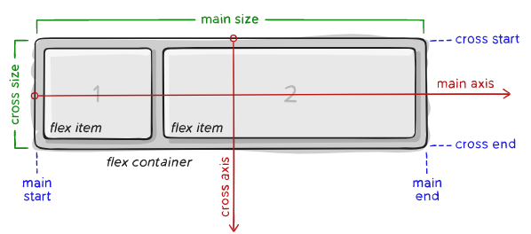
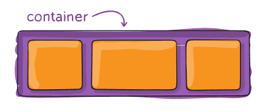
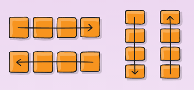
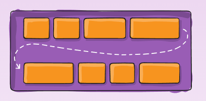
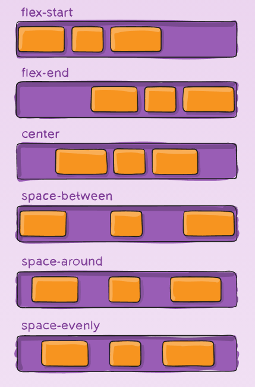
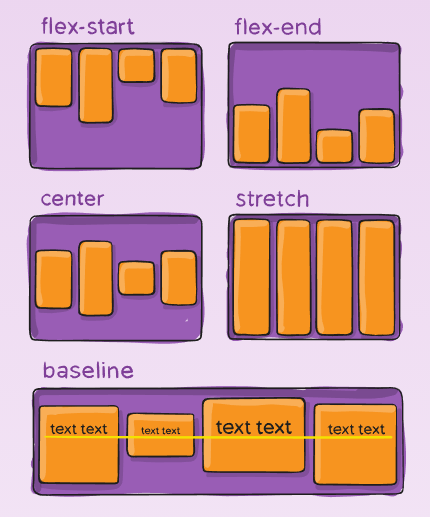
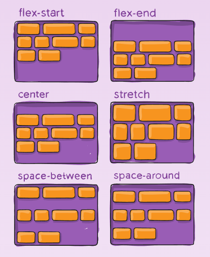
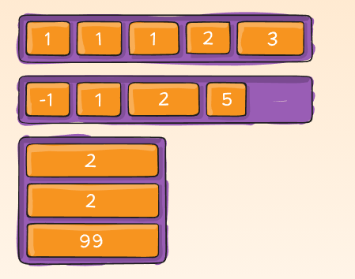
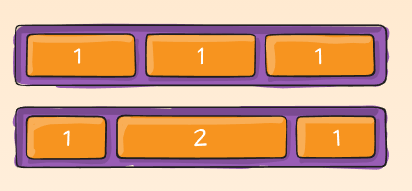
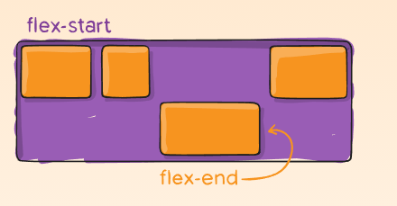

# 플렉스박스(flexbox)


- [플렉스박스 플레이그라운드](https://codepen.io/enxaneta/full/adLPwv/)

플렉스박스는 컨테이너안의 아이템을 행이나 열로써 나타내는 1차원적인 레이아웃입니다. 플렉스박스 컨테이너안의 아이템은 공간에 따라서 늘어나거나 작아질 수도 있습니다. 플렉스박스가 나온 이유는 이때까지는 `float`와 `position`을 이용한 레이아웃을 사용해 CSS 레이아웃을 만들었는데, 이것이 불편하였기 때문입니다. 플렉스박스를 이용하여 조금 더 쉽게 레이아웃을 짜봅시다.

**과제**

MDN에서 정리한 플렉스박스의 기본개념에 대해 먼저 읽어보세요.

- [플렉스박스 기본개념](https://developer.mozilla.org/ko/docs/Web/CSS/CSS_Flexible_Box_Layout/Flexbox%EC%9D%98_%EA%B8%B0%EB%B3%B8_%EA%B0%9C%EB%85%90)

## 기본 & 용어

플렉스박스는 여러가지 프로퍼티를 담고있는 모듈입니다. 이 여러가지의 프로퍼티들은 컨테이너에 사용되어야 하는 프로퍼티도 있고, 어떠한 프로퍼티들은 플렉스 아이템들에 사용되어야 합니다.

플렉스박스를 이해하려면, 플렉스 방향을 이해하여야 합니다.



아이템은 주축(main axis)이나 횡축(cross axis)을 통하여 놓아질 것입니다.

- **주축(main axis)**: 플렉스 컨테이너의 주축은 플렉스 아이템이 놓아지는 기본 값입니다. 주축은 `flex-direction`의 값에 따라 바뀔 수 있으며, 기본 값은 수평(row)이며, 수직(column)으로 바꾸어 줄 수도 있습니다.

- **주-시작(main-start) | 주-끝(main-start)**: 주축의 방향을 따라 주축의 시작점을 주-시작(main-start), 주축의 끝나는 점을 주-끝(main-end)라고 부릅니다.

<!-- - **주-크기(main-size)**: `flex-direction`의 값에 따라,  -->

- **교차축(cross axis)**: 교차축은 주축의 방향에 수직방향입니다. 만약 주축이 수평이라면, 교차축은 수직선을 그릴 것이며, 주축이 수직이라면 교차축은ㅇ 수평선을 그릴 것입니다.

- **교차-시작(cross-start) | 교차-끝(cross-end)**: 교차축의 방향을 따라 교차축의 시작점을 교차-시작(cross-start), 교차축의 끝나는 점을 교차-끝(cross-end)라고 부릅니다.

<!-- - **교차-크기(cross-size)**: -->


<!----------------------------- 
플렉스 컨테이너 
------------------------------>

## 부모 프로퍼티(플렉스 컨테이너)

### display

`display` 프로퍼티를 통해서 플렉스 컨테이너를 생성할 수 있습니다. 바로 밑의 태그들이 플렉스 아이템이 됩니다.

```css
.container {
    display: flex;
}
```

### flex-direction


`flex-direction`을 통해서 주축(main-axis)의 방향을 정할 수 있습니다. 플렉스박스는 1차원 레이아웃이기 때문에 플렉스 아이템들은 행(`row`) 아니면 열(`column`)방향으로 놓아집니다.

```css
.container {
    flex-direction: row | row-reverse | column | column-reverse;
}
```

- `row`(기본값): 수평으로 왼쪽에서 오른쪽으로 플렉스 아이템 정렬
- `row-reverse`: 수평으로 오른쪽에서 왼쪽으로 플렉스 아이템 정렬
- `column`: 주축(Main Axis)이 바뀜. `row`를 수직으로 생각하면 됨
- `column-reverse`: `row-reverse`를 수직으로 생각하면 됨

### flex-wrap



기본적으로 플렉스 아이템들은 한 줄에 정렬이 됩니다. 하지만 `flex-wrap` 프로퍼티를 통해서 플렉스 아이템을 여러 줄로 정렬할 수도 있다.

```css
.container {
    flex-wrap: nowrap | wrap | wrap-reverse;
}
```

- `nowrap`(기본값): 모든 플렉스 아이템들이 한 줄에 정렬됨
- `wrap`: 플렉스 아이템들이 여러 줄로 정렬됨. 위에서 아래로
- `wrap-reverse`: 플렉스 아이템들이 여러 줄로 정렬됨. 아래서 위로

### flex-flow

`flex-direction`과 `flex-wrap` 프로퍼티의 단축 프로퍼티. 기본 값은 `row nowrap` 입니다.

```css
.container {
    flex-flow: column wrap;
}
```

### justify-content



<!-- 더 많은 설명이 필요할 듯 -->
`justify-content` 프로퍼티는 주축(Main Axis)에 따라 놓여진 아이템들을 어떻게 정렬을 할 지 결정합니다.

```css
.container {
    justify-content: flex-start | flex-end | center | space-between | space-around | space-evenly | start | end | left | right
    
}
```
<!-- /*  ... + safe | unsafe; */ -->

- `flex-start`(기본값): 아이템들이 주축의 시작점에 정렬됩니다.
- `flex-end`: 아이템들이 주축의 끝나는 점에 정렬됩니다.
- `start`: 아이템들이 `writing-mode` 방향의 시작점에 정렬됩니다.
- `end`: 아이템들이 `writing-mode` 방향의 끝나는 점에 정렬됩니다.
- `left`: 아이템들이 컨테이너의 왼쪽 가장자리에 정렬됩니다. 만약에 `flex-direction`과 프로퍼티의 방향이 맞지 않는다면 `start`와 똑같이 작동합니다.
- `right`: 아이템들이 컨테이너의 오른쪽 가장자리에 정렬됩니다. 만약에 `flex-direction`과 프로퍼티의 방향이 맞지 않는다면 `start`와 똑같이 작동합니다.
- `center`: 아이템들이 중앙에 정렬이 됩니다.
- `space-between`: 첫번째 플렉스 아이템과 마지막 플렉스 아이템을 주축의 시작점과 끝나는 점에 놓고, 남은 공간을 아이템들의 사이에 공평하게 분배합니다.
- `space around`: 남은 공간을 플렉스 아이템의 옆에 알맞게 분배합니다. 중요한 것은, 플렉스 아이템들의 사이와, 플렉스 아이템과 시작점 혹은 끝나는 점까지의 공간은 다르다는 것을 아셔야 합니다. 왜냐하면, 각 플렉스 아이템마다 10px의 공간이 더 붙어져 있다면, 그 옆의 플렉스 아이템도 10px의 공간이 있기 때문에 이 둘 사이의 공간은 20px이 되기 때문입니다.
- `space-evenly`: 남은 공간이 공평하게 분배되어 어떠한 플렉스 아이템들의 사이의 공간도 똑같게 됩니다. **플렉스 아이템과 컨테이너의 시작점 혹은 끝나는 점까지의 공간도 똑같습니다.**

여기서 아셔야 할 것은, 이 프로퍼티의 값들이 아직 브라우저에서 지원을 안 하는 경우가 있습니다. 예를 들어, `start/end/left/right` 는 아직 크롬에서 지원을 안 합니다. MDN의 [페이지](https://developer.mozilla.org/en-US/docs/Web/CSS/justify-content)를 방문해보시면, 어떤 것이 지원되고 안 되는지 표를 보실 수 있습니다.

### align-items


`align-items` 프로퍼티는 `justify-content` 프로퍼티의 교차축 버전이라고 생각하시면 됩니다. 교차축에서 아이템들이 어떻게 정렬될지 결정합니다.

```css
.container {
  align-items: stretch | flex-start | flex-end | center | baseline | first baseline | last baseline | start | end | self-start | self-end
}
```
 <!-- + ... safe | unsafe; -->
- `stretch`(기본값): 플렉스 아이템들이 교차축을 따라 컨테이너의 남온공간을 채웁니다.
- `flex-start` / `start` / `self-start`: 아이템들이 교차축의 시작점에 정렬됩니다. 이들 사이의 차이는 아주 미묘한데, `flex-direction` 규칙을 따르느냐 `writing-mode` 규칙을 따르느냐의 차이입니다.

- `flex-end`/ `end` / `self-end`: 아이템들이 교차축의 끝에 배치됩니다. 이들 사이의 차이는 아주 미묘한데,`flex-direction` 규칙을 따르느냐 `writing-mode` 규칙을 따르느냐의 차이입니다.

- `center`: 교차축의 중앙에 정렬됩니다.
- `baseline`: 베이스라인에 맞춰 정렬됩니다.


### align-content


`align-content` 프로퍼티는 여러 줄로 된 플렉스 아이템들에 영향을 미칩니다.

- `normal`(기본값): 아무 값이 정해지지 않았다면 아이템들은 아무 적용되지 않은 값으로 원래의 위치에 있게됩니다.

- `flex-start` / `start`: 아이템들이 컨테이너의 시작점에 위치하게 됩니다. `flex-start`는 `flex-direction`의 방향에 영향을 받고, `start`는 `writing-mode`의 방향에 영향을 받습니다.

- `flex-end` / `end`: 아이템들이 컨테이너의 끝나는 점에 위치하게 됩니다. `flex-end`는 `flex-direction`의 방향에 영향을 받고, `end`는 `writing-mode`의 방향에 영향을 받습니다.

- `center`: 아이템들의 컨테이너의 중앙에 위치하게 됩니다.
- `space-between`: 아이템들이 공평하게 분배됩니다. 첫번째 아이템은 컨테이너의 시작점에, 마지막 아이템은 컨테이너의 마지막 점에 위치하게 됩니다.
- `space-around`: 각 아이템들의 매 줄 마다의 공간이 공평하게 분배됩니다.
<!-- ? -->
- `space-evenly`: 아이템들을 제외한 모든 빈 공간의 간격이 똑같게 분배됩니다.
<!-- ? -->
- `stretch`: 

<!----------------------------- 
플렉스 아이템 
------------------------------>

## 자식 프로퍼티(플렉스 아이템)

### order


자연적으로, 플렉스 아이템들은 소스코드에 나타난 순서대로 놓이게 됩니다. 하지만 `order` 프로퍼티를 이용하면, 플렉스 컨테이너에 나오는 순서를 조정할 수 있습니다. 기본 값은 0이며, 숫자가 크면 클수록 나오는 순서가 늦어집니다.

```css
.item {
    order: 5; /* 기본 값은 0 입니다. */
}
```


### flex-grow


`flex-grow` 프로퍼티를 통하여 플렉스 아이템의 크기를 키울 수 있습니다. 숫자를 값으로 받는데, 이 값이 비율로써 사용이 됩니다. 플렉스 컨테이너에 남은 공간을 얼마만큼 차지할 지 결정을 합니다. 만약에 플렉스 아이템들의 `flex-grow` 값이 1이고, 컨테이너에 남은 공간(Available Space)이 300px이라면, 플렉스 아이템들은 300px을 공평하게 분배할 것입니다. 만약에 어떠한 자식의 값이 2이고, 다른 플렉스 아이템들의 값이 1이라면, 2의 값을 가진 플렉스 아이템이 다른 플렉스 아이템들보다 2배 만큼 더 많은 공간을 가져갈 것입니다.

```css
.item {
    flex-grow: 4; /* 기본 값은 0입니다.*/
}
```

### flex-shrink

`flex-shrink` 프로퍼티는 만약에 필요하다면(컨테이너의 사이즈를 넘었을 때) 플렉스 아이템이 줄어들 수 있게 하여줍니다.

```css
.item {
    flex-shrink: 3; /* 기본 값은 1입니다. */
}
```

### flex-basis

`flex-basis` 프로퍼티는 남은 공간이 분배되기 전의 아이템의 사이즈를 측정합니다. 값으로는 길이(10%, 3rem, 40px)가 될 수도 있고 단어가 될 수도 있습니다. `auto`라는 값도 있는데 이것은 "나의 `width`와 `height` 속성을 참고해"라는 말입니다. `content` 라는 값은 "아이템의 컨텐츠 사이즈에 맞게 조정해" 라는 말입니다. `content` 는 아직 브라우저에서 잘 지원이 되지 않고 있습니다.

```css
.item {
    flex-basis: | auto; /* 기본 값은 auto입니다. */
}
```

만약에 값으로 `0`을 가지고 플렉스 아이템들의 크기가 컨테이너의 사이즈를 넘어서도, 플렉스 아이템들의 크기가 줄어들 지 않을 것입니다.

### flex

`flex` 프로퍼티는 `flex-grow`, `flex-shrink` 그리고 `flex-basis` 프로퍼티를 한 번에 지정하는 단축 프로퍼티입니다(`flex-shrink`와 `flex-basis`의 값은 선택적). 기본 값은 `0 1 auto` 입니다.

```css
.item {
    flex: none | /* flex-grow flex-shrink flex-basis */
}
```

각각의 개인적인 프로퍼티를 다 쓰는 것보다 `flex` 단축 프로퍼티를 이용하는 것이 대부분이고, 그런 방식이 추천되고 있습니다.

### align-self


`align-self` 프로퍼티를 사용하면, 플렉스 컨테이너에 지정된 정렬 값을 덮어쓸 수 있습니다. `align-items`와 똑같은 값을 가집니다.

```css
.item {
    align-self: auto | flex-start | flex-end | center | baseline | stretch;
}
```